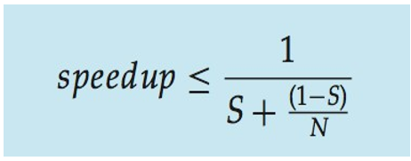

  <h1 style="font-weight: bold"> LAPORAN PRAKTIKUM X SISTEM OPERASI Thread</h1>
  <h4 style="text-align: center;">Dosen Pengampu : Dr. Ferry Astika Saputra, S.T., M.Sc.</h4>

 
 

  
  <h3 style="text-align: center;">Disusun Oleh : </h3>
  

    Firsty Angelica Valency (3123500029) 
  

  <h3 style="text-align: center;line-height: 1.5">Program Studi Teknik Informatika Departemen Teknik Informatika Dan Komputer Politeknik Elektronika Negeri Surabaya 2023/2024</h3>
  

# Daftar Isi
<!-- - [Overview](#Overview) -->
- [Multithreading Models](#MultithreadingModels)
- [Multicore Programming](#Multicoreprogramming)
- [Thread Libraries](#Threadlibraries)
- [Implicit Threading](#Implicittreading)
- [Threading Issues](#Threadingissues)
- [Operating System Examples](#Threadingissues)
- [Daftar Pustaka](#daftarpustaka)

<!-- # Overview

Sebagian besar aplikasi modern menggunakan thread multithread, yang berarti bahwa beberapa tugas dapat dilakukan oleh thread terpisah meliputi
- tampilan dapat diperbarui.
- mengambil data, 
- memeriksa ejaan, 
- dan menjawab permintaan jaringan. 

Pembuatan Thread ringan memungkinkan 

- penyederhanaan kode, 
- meningkatkan efisiensi kernel. -->

# Multithreading Models

**Multithreading** adalah sebuah teknik pemrograman yang memungkinkan sebuah aplikasi untuk menjalankan beberapa proses atau tugas secara bersamaan dalam satu proses aplikasi yang sama

### Arsitektur Multicore

**Manfaat**
1. Responsiveness – dapat mengizinkan eksekusi lanjutan jika bagian dari proses diblokir, terutama penting untuk antarmuka pengguna
2. Resource Sharing – thread berbagi sumber daya proses, lebih mudah daripada berbagi memori atau penyampaian pesan
3. Economy – lebih murah daripada pembuatan proses, peralihan thread overhead lebih rendah daripada peralihan konteks
4. Scalability – proses dapat memanfaatkan arsitektur multiprosesor

# Multicore Programming

**Multicore Processor** adalah sebuah processor komputer yang terdiri dari 2 chip atau lebih unit pengolah secara terpisah yang masing-masing bekerja dan mengeksekusi instruksi program.

Tantangan :
- Dividing activities
- Balance
- Data splitting
- Data dependency
- Testing and debugging

### Paralel
**Paralelisme** menyiratkan suatu sistem dapat melakukan lebih dari satu tugas secara bersamaan

- Paralelisme data: mendistribusikan subset dari data yang sama ke beberapa inti, operasi yang sama pada masing-masing inti

- Paralelisme tugas: mendistribusikan thread ke seluruh inti, setiap thread melakukan operasi unik

### Note  
- Seiring bertambahnya jumlah thread, dukungan arsitektural untuk threading juga meningkat
CPU juga memiliki hardware Thread
  
- Pertimbangkan Oracle SPARC T4 dengan 8 core, dan 8 thread perangkat keras per core

### Concurrency vs. Parallelism

Concurrency pada single core

(proses lebih lama)

Parallelism pada multicore

(proses lebih cepat)

### Hukum Amdahl

**Hukum ini**cMengidentifikasi peningkatan kinerja dari penambahan inti tambahan ke aplikasi yang memiliki komponen serial dan paralel. 

- N = processing core
- S = serial 

Artinya, jika aplikasi 75% paralel / 25% serial, perpindahan dari 1 ke 2 inti akan menghasilkan kecepatan 1,6 kali lipat
  
Sebagai N mendekati tak terhingga, percepatan mendekati 1 /S

        Porsi serial suatu aplikasi memiliki efek yang tidak proporsional terhadap kinerja yang diperoleh dengan menambahkan core tambahan

**Grafik**

### User Threads and Kernel Threads

**User Thread** : management yang dilakukan oleh user berdasarkan level pada library threads

 **Library utama Thread:** 

 1. POSIX Pthreads
 2. Windows threads
 3. Java threads

**Kernel threads** : Didukung oleh Kernel
contoh:
1. Windows
2. Solaris
3. Linux
4. Tru64 UNIX
5. Mac OS X

### Multithreading Models

1. **Many-to-One**

- Banyak thread tingkat pengguna yang dipetakan ke thread kernel tunggal

- Pemblokiran satu thread menyebabkan semua diblokir
  
-  Beberapa thread mungkin tidak berjalan secara paralel pada sistem muticore karena hanya satu thread yang dapat berada di kernel pada satu waktu
  
- Hanya sedikit sistem yang saat ini menggunakan model  ini. 

Contoh:

a. Solaris Green Threads

b. GNU Portable Threads

2. **One-to-One**

- Setiap thread tingkat pengguna terhubung ke thread kernel, yang membuat thread kernel lebih kompetitif daripada membuat banyak-ke-satu. 

- Jumlah thread yang dapat digunakan oleh setiap proses terkadang dibatasi oleh overhead. 

Contoh: 
a. Windows

b. Linux

c. Solaris 9 dan lain-lain

3. **Many-to-Many Model**

- Memungkinkan banyak thread tingkat pengguna dipetakan ke banyak thread kernel
  
- Mengizinkan sistem operasi membuat thread kernel dalam jumlah yang memadai
  
- Contohnya adalah Solaris sebelum versi 9 dan Windows dengan ThreadFiber package

4. **Two-level Model**

- Mirip dengan M:M, hanya saja dia mengizinkan adanya user thread melompat ke kernel thread

contoh :

a. IRIX

b. HP-UX

c. Tru64 UNIX

d. Solaris 8 

# Thread libraries

**Thread library** memberi programmer API untuk membuat dan mengelola thread.

- Dua cara utama penerapan
  - Library seluruhnya ada di ruang pengguna 
  - Library tingkat kernel yang didukung oleh OS

### Pthreads

- Dapat disediakan baik sebagai tingkat pengguna atau tingkat kernel
  
- API standar POSIX (IEEE 1003.1c) untuk pembuatan dan sinkronisasi thread
  
- Spesifikasi, bukan penerapan
  
- API menentukan perilaku perpustakaan thread, implementasi terserah pengembangan perpustakaan
  
- Umum pada sistem operasi UNIX (Solaris, Linux, Mac OS X)

### Contoh 

- thread

    

    

- Menggabungkan 10 thread

    

- Windows Multithreaded C Program

    

    

- Java Threads

    - dikelola oleh JVM
  
    - Biasanya diimplementasikan menggunakan model thread yang disediakan oleh OS yang mendasarinya

         

    - Memperluas kelas Thread
    - Menerapkan antarmuka Runnable

         

         

# Implicit Threading

- Semakin populer seiring bertambahnya jumlah thread, kebenaran program menjadi lebih sulit dengan thread eksplisit
   
- Pembuatan dan pengelolaan thread dilakukan oleh compiler dan run-time libraries, bukan oleh programer

- **Metode Explorasi**
1. Thread Pools

    Membuat sejumlah thread dalam sebuah kumpulan di mana mereka menunggu pekerjaan

- Keuntungan:
    - Biasanya sedikit lebih cepat untuk melayani permintaan dengan thread yang sudah ada daripada membuat thread baru

    - Mengizinkan jumlah thread dalam aplikasi terikat pada ukuran kumpulan
    
    - Memisahkan tugas yang akan dilakukan dari mekanisme pembuatan tugas memungkinkan strategi berbeda untuk menjalankan tugas

    - -ieTasks dapat dijadwalkan untuk dijalankan secara berkala

- Windows API

     

2. OpenMP

- Kumpulan arahan compiler dan API untuk C, C++, FORTRAN
  
- Memberikan dukungan untuk pemrograman paralel di lingkungan memori bersama

- Mengidentifikasi  parallel regions blok kode yang dapat berjalan secara paralel

    

     

3. Grand Central Dispatch

- Pemanfaatannya pada Teknologi Apple untuk sistem operasi Mac OS X dan iOS   Ekstensi ke C, bahasa C++, API, dan run-time library 

- Memungkinkan identifikasi bagian paralel

- Mengelola sebagian besar detail threading

- Blok ada di  “^{ }” - ˆ{ printf("I am a block"); } Blok ditempatkan dalam antrian pengiriman
  
- Ditugaskan ke thread yang tersedia di kumpulan thread saat dihapus dari antrian

### Jenis Antrian Pengiriman:

- **main queue** serial – blok dihapus dalam urutan FIFO, antrian per proses. Lalu, Pemrogram dapat membuat antrian serial tambahan di dalam program

- **bersamaan** dihapus dalam urutan FIFO tetapi beberapa dapat dihapus sekaligus. Lalu, Tiga antrian seluruh sistem dengan prioritas rendah, default, tinggi.

    

4. Metode lain : 
- Microsoft Threading Building Blocks
(TBB), 
- java.util.concurrent package

# Threading Issues

- **Semantik dari fork() dan exe() sistem call**

Fork dapat menduplikasi semua thread dari proses induk ke proses anak atau hanya yang dipanggil oleh proses induk. Aplikasi akan menentukan versi fork() mana yang akan digunakan.

Ketika panggilan sistem berikutnya, yaitu panggilan sistem exec() dikeluarkan, ia menggantikan seluruh pemrograman dengan semua threadnya dengan program yang ditentukan dalam parameter panggilan sistem exec(). Biasanya, panggilan sistem exec() masuk ke antrian setelah panggilan sistem fork().

Namun, hal ini menyiratkan bahwa pemanggilan sistem exec() tidak boleh diantrekan segera setelah pemanggilan sistem fork() karena menduplikasi semua thread dari proses induk ke dalam proses anak akan sia-sia. Karena panggilan sistem exec() akan menimpa seluruh proses dengan proses yang diberikan dalam argumen yang diteruskan ke exec().

Artinya dalam kasus seperti ini; sebuah fork() yang hanya mereplikasi satu thread pemanggil sudah cukup.

- **Penanganan sinyal**
    a. Synchronous:

    - Kelebihan Synchronous
        1.  Simplicity and predictability: Metode synchronous lebih mudah dipahami karena instruksi dieksekusi satu per satu secara berurutan. Hal ini membuatnya lebih mudah untuk memprediksi apa yang akan terjadi selanjutnya dalam program.

        2.  Easy debugging: Dalam synchronous, ketika terjadi kesalahan atau bug, kita dapat dengan mudah mengidentifikasi instruksi yang menyebabkan masalah karena setiap instruksi dieksekusi secara linear dan dapat dilacak.

        3.  Easier logic implementation: Dalam metode synchronous, logika program terstruktur secara berurutan dan mudah dipahami. Kita tidak perlu memikirkan asynchronous callback atau event handling yang kompleks.

        4.  Thread safety: Pada kebanyakan kasus synchronous, operasi operasi dieksekusi secara thread-safe, artinya tidak ada masalah yang terjadi saat beberapa operasi berjalan bersamaan.

        5.  Performance-oriented: Pada beberapa kasus, synchronous dapat memberikan performa yang lebih baik, terutama ketika beban kerja sedang dan instruksi-instruksi dapat dieksekusi dengan cepat.

        6.  Guaranteed order: Dalam metode synchronous, hasil instruksi akan selalu dalam urutan yang sama seperti urutan eksekusi instruksi.

        7.  Extendable architecture: Metode synchronous lebih mudah untuk diperluas, karena kita dapat dengan mudah menambahkan atau mengubah urutan eksekusi instruksi.

    - Kekurangan Synchronous
        1.  Waiting time: Salah satu kekurangan synchronous adalah waktu tunggu atau waiting time. Ketika ada instruksi yang membutuhkan waktu eksekusi yang lama, semua instruksi berikutnya harus menunggu sampai instruksi tersebut selesai dieksekusi.

        2.  Blocking operations: Dalam metode synchronous, jika ada operasi yang membutuhkan waktu lama atau terhalang, operasi-operasi berikutnya akan terhenti dan tidak dapat berjalan sampai operasi tersebut selesai.

        3.  Limited scalability: Metode synchronous tidak dapat dengan mudah diukur untuk skala yang lebih besar atau beban kerja yang lebih tinggi.

        4.  Single-threaded: Pada kebanyakan kasus, proses synchronous dilakukan pada satu thread tunggal. Hal ini dapat menyebabkan kinerja terhambat jika ada instruksi yang membutuhkan waktu eksekusi yang lama.

        5.  Network latency: Pada operasi jaringan, synchronous dapat menjadi bumerang ketika ada keterlambatan atau latency yang merugikan pengalaman pengguna.

        6.  Deadlocks: Dalam synchronous, jika ada instruksi yang terjebak dalam loop atau ada kondisi yang tidak terpenuhi, bisa menyebabkan deadlock atau terjebak dalam satu titik.

        7.  Increased resource utilization: Metode synchronous menggunakan sumber daya yang lebih besar dibandingkan dengan asynchronous, karena setiap instruksi harus menunggu instruksi sebelumnya selesai.

    b. Asynchronous: 
    - Kelebihan Asynchronous
        1.  Improved responsiveness: Salah satu keunggulan utama asynchronous adalah responsifitas yang lebih baik karena program tidak perlu menunggu instruksi sebelumnya selesai. Ini memungkinkan program untuk menjalankan tugas lainnya.

        2.  Non-blocking operations: Dalam asynchronous, instruksi-instruksi dapat berjalan secara independen tanpa terhalang oleh operasi yang membutuhkan waktu lama.

        3.  Event-driven architecture: Metode asynchronous sangat berguna dalam menghadapi pengolahan event atau kondisi tertentu yang akan dijalankan secara independen.

        4.  Improved scalability: Dalam metode asynchronous, program biasanya dapat dengan mudah diukur untuk skala yang lebih besar atau beban kerja yang lebih tinggi.

        5.  Time and resource optimization: Asynchronous memungkinkan program untuk melakukan tugas lain sambil menunggu operasi yang membutuhkan waktu lama seperti pemrosesan data atau operasi jaringan.

        6.  Better network performance: Ketika berurusan dengan operasi jaringan, asynchronous memberikan performa yang lebih baik karena program tidak harus terus menunggu tanggapan dari server.

        7.  Reduced resource utilization: Asynchronous menggunakan sumber daya yang lebih efisien karena instruksi-instruksi dapat berjalan secara bersamaan dan tidak harus menunggu instruksi sebelumnya selesai.

    - Kekurangan Asynchronous
        1.  Complexity: Salah satu tantangan dalam asynchronous adalah kompleksitas pengaturan dan pengelolaan callback atau event handling.

        2.  Difficult debugging: Dalam asynchronous, mengidentifikasi kesalahan dapat menjadi lebih sulit karena instruksi-instruksi dieksekusi secara independen dan tidak berurutan.

        3.  Inconsistent order: Metode asynchronous tidak menjamin urutan hasil instruksi, sehingga dapat menyulitkan untuk menangani hasil yang harus dieksekusi secara berurutan.

        4.  Race conditions: Dalam asynchronous, jika ada instruksi yang bersaing untuk akses data atau sumber daya yang sama, dapat terjadi race conditions atau kondisi persaingan yang dapat menyebabkan hasil yang tidak konsisten atau tidak diinginkan.

        5.  Complex error handling: Ketika terjadi kesalahan dalam metode asynchronous, penanggulangan kesalahan atau error handling bisa lebih rumit karena instruksi-instruksi dieksekusi secara independen dan tidak berurutan.

        6.  Dependency management: Dalam asynchronous, saat ada instruksi yang membutuhkan hasil dari instruksi sebelumnya, manajemen dependensi harus diperhatikan agar tidak terjadi kesalahan.

        7.  Resource contention: Dalam asynchronous, jika tidak dikelola dengan baik, instruksi-instruksi dapat memperebutkan sumber daya dan menyebabkan penurunan performa.

        Sinyal digunakan dalam sistem UNIX untuk memberi tahu suatu proses bahwa peristiwa tertentu telah terjadi.
        Signal Handler digunakan untuk memproses sinyal

        1.	Sinyal dihasilkan oleh peristiwa tertentu
        2.	Sinyal dikirimkan ke suatu proses
        3.	Sinyal ditangani oleh salah satu dari dua penangan sinyal:
            -	bawaan
            -	ditetapkan pengguna

        Setiap sinyal punya  default handler  defaultkernel itu berjalan saat menangani sinyal
        - User-defined signal handler bisa mengganti default
        - default untuk single thread dikirim ke process
        
        Pengendali sinyal yang ditentukan penggunadapat mengesampingkan default Untuk single-thread, sinyal dikirim ke proses

        - Di mana sinyal harus dikirimkan untuk multi-thread?
            1.  Mengirimkan sinyal ke thread dimana sinyal tersebut diterapkan
            2. Mengirimkan sinyal ke setiap thread dalam proses
            3. Mengirimkan sinyal ke thread tertentu dalam proses
            4. Tetapkan thread tertentu untuk menerima semua sinyal untuk proses tersebut

        c. Pembatalan Thread
        Mengakhiri thread sebelum selesai Thread yang  akan dibatalkan adalah target thread
        1. Pembatalan asinkron segera mengakhiri thread target
        2. Deferred cancellation memungkinkan thread target memeriksa secara berkala apakah harus dibatalkan

        - code Pthread untuk membuat dan membatalkan thread

            

        - Memanggil pembatalan thread dan meminta pembatalan, namun pembatalan sebenarnya bergantung pada status thread

            

            - Jika thread memiliki pembatalan yang dinonaktifkan, pembatalan akan tetap tertunda hingga thread mengaktifkannya Tipe default ditangguhkan

            - Jika thread memiliki pembatalan yang dinonaktifkan, pembatalan akan tetap tertunda hingga thread mengaktifkannya dengan Default type
                - Pembatalan hanya terjadi ketika thread mencapai cancellation point
                     

                     Kemudian cleanup handler dipanggil

        - Pada sistem Linux, pembatalan thread ditangani melalui sinyal

### Thread-Local Storage

Penyimpanan thread-lokal(TLS) memungkinkan setiap thread memiliki salinan datanya sendiri

- Berguna ketika Anda tidak memiliki kendali atas proses pembuatan thread (yaitu, saat menggunakan kumpulan thread)
- Berbeda dengan variabel lokal
  - Variabel lokal hanya terlihat selama pemanggilan fungsi tunggal
  - TLS terlihat di seluruh pemanggilan fungsi   
- Mirip denganstatisdata
  - TLS unik untuk setiap thread

### Scheduler Activations
 

- Baik model M:M maupun Dua tingkat memerlukan komunikasi untuk mempertahankan jumlah thread kernel yang sesuai yang dialokasikan untuk aplikasi

- Biasanya menggunakan struktur data perantara antara thread pengguna dan kernel –proses ringan(LWP)

- Tampaknya menjadi prosesor virtual di mana proses dapat menjadwalkan thread pengguna untuk dijalankan
    - Setiap LWP melekat pada thread kernel.
    - Berapa banyak LWP yang harus dibuat?
  
- Aktivasi penjadwal menyediakan upcalls - mekanisme komunikasi dari kernel ke upcall handler di thread library
  
- Komunikasi ini memungkinkan aplikasi untuk mempertahankan jumlah thread kernel yang benar

# Operating System Examples

## WINDOWS

- Windows mengimplementasikan Windows API – API utama untuk Win 98, Win NT, Win 2000, Win XP, dan Win 7

- Mengimplementasikan pemetaan one-to-one, 

- Kernel level yang ada ditiap thread
    1. thread id
    2. set representing state of processor
    3. Separate user and kernel stacks for when thread runs in user mode or kernel mode
    4. Private data storage area used by

- Struktur data utama dari sebuah thread meliputi:
    1. ETHREAD (executive thread block) – menyertakan penunjuk ke proses milik thread mana dan ke KTHREAD, di ruang kernel
    2. KTHREAD (kernel thread block) – info penjadwalan dan sinkronisasi, tumpukan mode kernel, penunjuk ke TEB, di ruang kernel
    3. TEB (thread environment block) – id thread, tumpukan mode pengguna, penyimpanan lokal thread, di ruang pengguna

        

## LINUX

- Linux menyebutnya sebagai task daripada thread

- Pembuatan Thread dilakukan melalui clone() sistem call

- clone() memungkinkan child task untuk berbagi ruang alamat parents task (proses)

       

    (struct tugas_struct menunjuk untuk memproses struktur data (bersama atau unik))

# Daftar Pustaka

- https://www.tujuwan.com/2019/09/Pengertian-multocore-processor-fungsi-dan-kelebihannya.html#google_vignette

- https://www.geeksforgeeks.org/threading-issues/

- https://www.mahirkoding.com/threading-dan-synchronization/