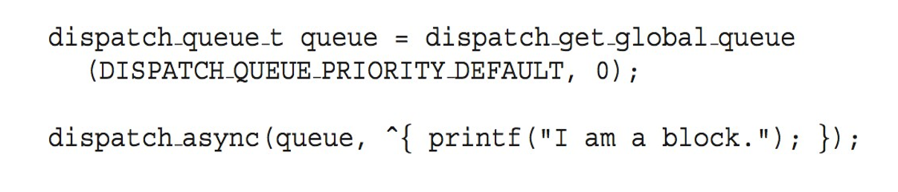

  <h1 style="font-weight: bold"> LAPORAN PRAKTIKUM VI SISTEM OPERASI Proses dan Manajemen Proses</h1>
  <h4 style="text-align: center;">Dosen Pengampu : Dr. Ferry Astika Saputra, S.T., M.Sc.</h4>

 
 

  
  <h3 style="text-align: center;">Disusun Oleh : </h3>
  

    Firsty Angelica Valency (3123500029) 
  

  <h3 style="text-align: center;line-height: 1.5">Program Studi Teknik Informatika Departemen Teknik Informatika Dan Komputer Politeknik Elektronika Negeri Surabaya 2023/2024</h3>
  

# Daftar Isi
<!-- - [Overview](#Overview) -->
- [Multithreading Models](#MultithreadingModels)
- [Multicore Programming](#Multicoreprogramming)
- [Thread Libraries](#Threadlibraries)
- [Implicit Threading](#Implicittreading)
- [Threading Issues](#Threadingissues)
- [Operating System Examples](#Threadingissues)
- [Daftar Pustaka](#daftarpustaka)

<!-- # Overview

Sebagian besar aplikasi modern menggunakan thread multithread, yang berarti bahwa beberapa tugas dapat dilakukan oleh thread terpisah meliputi
- tampilan dapat diperbarui.
- mengambil data, 
- memeriksa ejaan, 
- dan menjawab permintaan jaringan. 

Pembuatan Thread ringan memungkinkan 

- penyederhanaan kode, 
- meningkatkan efisiensi kernel. -->

# Multithreading Models

**Multithreading** adalah sebuah teknik pemrograman yang memungkinkan sebuah aplikasi untuk menjalankan beberapa proses atau tugas secara bersamaan dalam satu proses aplikasi yang sama

### Arsitektur Multicore

**Manfaat**
1. Responsiveness – dapat mengizinkan eksekusi lanjutan jika bagian dari proses diblokir, terutama penting untuk antarmuka pengguna
2. Resource Sharing – thread berbagi sumber daya proses, lebih mudah daripada berbagi memori atau penyampaian pesan
3. Economy – lebih murah daripada pembuatan proses, peralihan thread overhead lebih rendah daripada peralihan konteks
4. Scalability – proses dapat memanfaatkan arsitektur multiprosesor

# Multicore Programming

**Multicore Processor** adalah sebuah processor komputer yang terdiri dari 2 chip atau lebih unit pengolah secara terpisah yang masing-masing bekerja dan mengeksekusi instruksi program.

Tantangan :
- Dividing activities
- Balance
- Data splitting
- Data dependency
- Testing and debugging

### Paralel
**Paralelisme** menyiratkan suatu sistem dapat melakukan lebih dari satu tugas secara bersamaan

- Paralelisme data: mendistribusikan subset dari data yang sama ke beberapa inti, operasi yang sama pada masing-masing inti

- Paralelisme tugas: mendistribusikan thread ke seluruh inti, setiap thread melakukan operasi unik

### Note  
- Seiring bertambahnya jumlah thread, dukungan arsitektural untuk threading juga meningkat
CPU juga memiliki hardware Thread
  
- Pertimbangkan Oracle SPARC T4 dengan 8 core, dan 8 thread perangkat keras per core

### Concurrency vs. Parallelism

Concurrency pada single core

(proses lebih lama)

Parallelism pada multicore

(proses lebih cepat)

### Hukum Amdahl

**Hukum ini**cMengidentifikasi peningkatan kinerja dari penambahan inti tambahan ke aplikasi yang memiliki komponen serial dan paralel. 

- N = processing core
- S = serial 

Artinya, jika aplikasi 75% paralel / 25% serial, perpindahan dari 1 ke 2 inti akan menghasilkan kecepatan 1,6 kali lipat
  
Sebagai N mendekati tak terhingga, percepatan mendekati 1 /S

        Porsi serial suatu aplikasi memiliki efek yang tidak proporsional terhadap kinerja yang diperoleh dengan menambahkan core tambahan

**Grafik**

### User Threads and Kernel Threads

**User Thread** : management yang dilakukan oleh user berdasarkan level pada library threads

 **Library utama Thread:** 

 1. POSIX Pthreads
 2. Windows threads
 3. Java threads

**Kernel threads** : Didukung oleh Kernel
contoh:
1. Windows
2. Solaris
3. Linux
4. Tru64 UNIX
5. Mac OS X

### Multithreading Models

1. **Many-to-One**

- Banyak thread tingkat pengguna yang dipetakan ke thread kernel tunggal

- Pemblokiran satu thread menyebabkan semua diblokir
  
-  Beberapa thread mungkin tidak berjalan secara paralel pada sistem muticore karena hanya satu thread yang dapat berada di kernel pada satu waktu
  
- Hanya sedikit sistem yang saat ini menggunakan model  ini. 

Contoh:

a. Solaris Green Threads

b. GNU Portable Threads

2. **One-to-One**

- Setiap thread tingkat pengguna terhubung ke thread kernel, yang membuat thread kernel lebih kompetitif daripada membuat banyak-ke-satu. 

- Jumlah thread yang dapat digunakan oleh setiap proses terkadang dibatasi oleh overhead. 

Contoh: 
a. Windows

b. Linux

c. Solaris 9 dan lain-lain

3. **Many-to-Many Model**

- Memungkinkan banyak thread tingkat pengguna dipetakan ke banyak thread kernel
  
- Mengizinkan sistem operasi membuat thread kernel dalam jumlah yang memadai
  
- Contohnya adalah Solaris sebelum versi 9 dan Windows dengan ThreadFiber package

4. **Two-level Model**

- Mirip dengan M:M, hanya saja dia mengizinkan adanya user thread
melompat ke kernel thread

contoh :

a. IRIX

b. HP-UX

c. Tru64 UNIX

d. Solaris 8 

# Thread libraries

**Thread library** memberi programmer API untuk membuat dan mengelola thread.

- Dua cara utama penerapan
  - Library seluruhnya ada di ruang pengguna 
  - Library tingkat kernel yang didukung oleh OS

### Pthreads

- Dapat disediakan baik sebagai tingkat pengguna atau tingkat kernel
  
- API standar POSIX (IEEE 1003.1c) untuk pembuatan dan sinkronisasi thread
  
- Spesifikasi, bukan penerapan
  
- API menentukan perilaku perpustakaan thread, implementasi terserah pengembangan perpustakaan
  
- Umum pada sistem operasi UNIX (Solaris, Linux, Mac OS X)

### Contoh 

- thread

    

    

- Menggabungkan 10 thread

    

- Windows Multithreaded C Program

    

    

- Java Threads

    - dikelola oleh JVM
  
    - Biasanya diimplementasikan menggunakan model thread yang disediakan oleh OS yang mendasarinya

         

    - Memperluas kelas Thread
    - Menerapkan antarmuka Runnable

         

         

# Implicit Threading

- Semakin populer seiring bertambahnya jumlah thread, kebenaran program menjadi lebih sulit dengan thread eksplisit
   
- Pembuatan dan pengelolaan thread dilakukan oleh compiler dan run-time libraries, bukan oleh programer

- **Metode Explorasi**
1. Thread Pools

    Membuat sejumlah thread dalam sebuah kumpulan di mana mereka menunggu pekerjaan

- Keuntungan:
    - Biasanya sedikit lebih cepat untuk melayani permintaan dengan thread yang sudah ada daripada membuat thread baru

    - Mengizinkan jumlah thread dalam aplikasi terikat pada ukuran kumpulan
    
    - Memisahkan tugas yang akan dilakukan dari mekanisme pembuatan tugas memungkinkan strategi berbeda untuk menjalankan tugas

    - -ieTasks dapat dijadwalkan untuk dijalankan secara berkala

- Windows API

     

2. OpenMP

- Kumpulan arahan compiler dan API untuk C, C++, FORTRAN
  
- Memberikan dukungan untuk pemrograman paralel di lingkungan memori bersama

- Mengidentifikasi  parallel regions blok kode yang dapat berjalan secara paralel

    

     

3. Grand Central Dispatch

- Pemanfaatannya pada Teknologi Apple untuk sistem operasi Mac OS X dan iOS   Ekstensi ke C, bahasa C++, API, dan run-time library 

- Memungkinkan identifikasi bagian paralel

- Mengelola sebagian besar detail threading

- Blok ada di  “^{ }” - ˆ{ printf("I am a block"); } Blok ditempatkan dalam antrian pengiriman
  
- Ditugaskan ke thread yang tersedia di kumpulan thread saat dihapus dari antrian

### Jenis Antrian Pengiriman:

- **main queue** serial – blok dihapus dalam urutan FIFO, antrian per proses. Lalu, Pemrogram dapat membuat antrian serial tambahan di dalam program

- **bersamaan** dihapus dalam urutan FIFO tetapi beberapa dapat dihapus sekaligus. Lalu, Tiga antrian seluruh sistem dengan prioritas rendah, default, tinggi.

    

4. Metode lain : 
- Microsoft Threading Building Blocks
(TBB), 
- java.util.concurrent package

# Threading Issues

# Operating System Examples

# Daftar Pustaka

- https://www.tujuwan.com/2019/09/Pengertian-multocore-processor-fungsi-dan-kelebihannya.html#google_vignette

