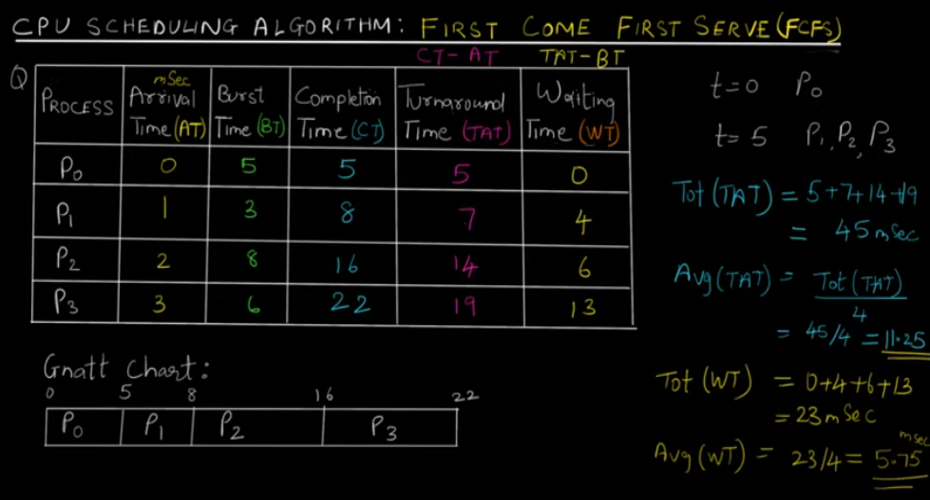
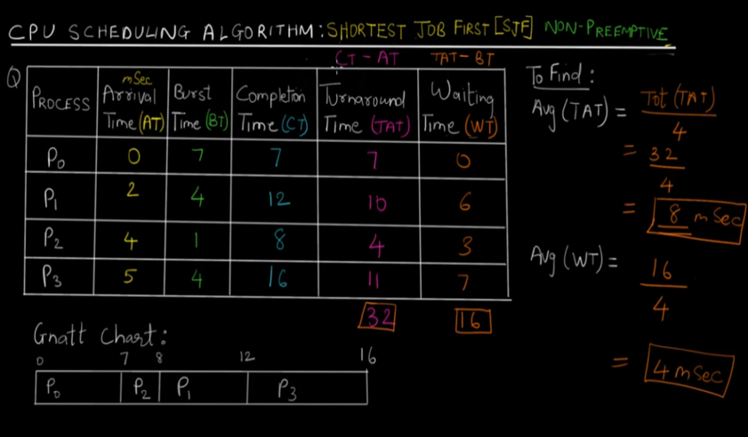

  <h1 style="font-weight: bold">FLOWCHART FJS, SJF dan Round Robin</h1>
  <h4 style="text-align: center;">Dosen Pengampu : Dr. Ferry Astika Saputra, S.T., M.Sc.</h4>

 
 

  
  <h3 style="text-align: center;">Disusun Oleh : </h3>
  

    Firsty Angelica Valency (3123500029) 
  

  <h3 style="text-align: center;line-height: 1.5">Program Studi Teknik Informatika Departemen Teknik Informatika Dan Komputer Politeknik Elektronika Negeri Surabaya 2023/2024</h3>
  

# Daftar Isi
- [Pendahuluan](#a-pendahuluan)
- [Tugas Pendahuluan](#b-tugas-pendahuluan)
- [Kesimpulan](#c-kesimpulan)
- [Daftar Pustaka](#d-daftarpustaka)

# A. Pendahuluan
### Dasar Teori
**A.	FCFS (First Come First Served)**

Algoritma ini merupakan algoritma penjadwalan yang paling sederhana yang digunakan CPU. Dengan menggunakan algoritma ini setiap proses yang berada pada status ready dimasukkan kedalam **FIFO queue** atau antrian dengan prinsip first in first out, sesuai dengan waktu kedatangannya. Proses yang tiba terlebih dahulu yang akan dieksekusi.

Algoritma FCFS dalam prosesnya tidak mengizinkan sebuah penyelaan dari segi apapun, dengan kata lain **Algoritma FCFS** ini **bersifat non-preempetive** atau **tidak dapat dilakukan interrupt** oleh proses lain. walaupun proses yang menunggu memiliki prioritas yang lebih tinggi.

**Kelemahan dari algoritma ini:**

- Waiting time rata-ratanya cukup lama 
- Terjadinya convoy effect, yaitu proses-proses menunggu lama untuk menunggu 1 proses besar yang sedang dieksekusi oleh CPU

**B.	Shortest-Job-First-Scheduling (SJF)**

Algoritma Shortest Job First Scheduling (SJF) ini memungkinkan setiap proses yang memiliki burst time (waktu pengerjaan) terkecil yang akan dikerjakan terlebih dahulu. 

Hal ini mengakibatkan waiting time yang pendek untuk setiap proses dan otomatis waiting time rata-ratanya juga menjadi pendek pula, sehingga dapat dikatakan bahwa algoritma ini adalah algoritma yang optimal. Algoritma Shortest Job First Scheduling (SJF) ini memiliki 2 jenis, yaitu :

**1. Shortest Job First Scheduling Non-preemptive**

CPU tidak memperbolehkan proses yang ada di ready queue untuk menggeser proses yang sedang dieksekusi oleh CPU meskipun proses yang baru tersebut mempunyai burst time yang lebih kecil.  

**2. Shortest Job First Scheduling Preemptive**

Jika ada proses yang sedang dieksekusi oleh CPU dan terdapat proses di ready queue dengan burst time yang lebih kecil daripada proses yang sedang dieksekusi tersebut, maka proses yang sedang dieksekusi oleh CPU akan digantikan oleh proses yang berada di ready queue tersebut. 

**Preemptive SJF** sering disebut juga **Shortest-Remaining-Time-First scheduling**
**Kelemahan dari algoritma ini:**

- Susahnya untuk memprediksi burst time proses yang akan dieksekusi selanjutnya
- Proses yang mempunyai burst time yang besar akan memiliki waiting time yang besar pula karena yang dieksekusi terlebih dahulu adalah proses dengan burst time yang lebih kecil

**C.    Round Robin**

Algoritma penjadwalan yang menggilir proses secara berurutan. Dalam algoritma ini setiap proses akan mendapatkan waktu dari CPU yang kita kita sebut dengan **time quantum**. Time quantum adalah suatu satuan waktu. 

Time quantum inilah yang menentukan proses mana yang akan dikerjakan terlebih dahulu oleh CPU dan kemudian proses mana yang akan dilakukan berikutnya. Biasanya suatu proses mendapat jatah time quantum yang sama dari CPU yakni **1-100 milidetik atau (1/n)**. 

Jika proses yang sedang dieksekusi selesai dalam waktu kurang dari 1 time quantum, tidak ada masalah. Tetapi jika proses berjalan melebihi 1 time quantum, maka proses tersebut akan dihentikan,lalu digantikan oleh proses yang berikutnya. Proses yang dihentikan tersebut akan diletakkan di queue di urutan paling belakang.

**Kelemahan algoritma Round Robin** 
-  menentukan besarnya time quantum.  Jika time quantum yang ditentukan terlalu kecil, maka sebagian besar proses tidak akan selesai dalam 1 time quantum. Hal ini tidak baik karena akan terjadi **banyak switch**, padahal CPU memerlukan waktu untuk beralih dari suatu proses ke proses lain (disebut dengan context switches time). Sebaliknya, jika time quantum terlalu besar, Algoritma Round Robin akan berjalan seperti algoritma First Come First Served. **Time quantum yang ideal** adalah jika **80% dari total proses memiliki CPU burst time yang lebih kecil dari 1 time quantum**.

# B. Tugas Pendahuluan

Pilihlah salah satu source code dari FCFS, SJF dan Round Robin kemudian buatlah Flowchart untuk setiap algoritmanya !

**1. FCFS (First Come First Served)**

- Contoh FCFS

    

- Output Source code

     

- Flowchart algoritma FCFS (First Come First Served)

    

- Analisis

Program diatas merupakan FCFS (First Come First Served) dengan metode Non-Preemtive. `proc` menyimpan informasi setiap proses yaitu nomor, arrival time, burst time, turnaround time dan waktu selesai. User mengimput banyaknya proses yang ingin dieksekusi lalu akan **diurutkan sesuai dengan arrival timenya**. Program menampilkan informasi AT, BT. CT, TAT, WT, RT dan rata-rata TAT juga WT.

**2. Shortest Job First (SJF) Scheduling Non-preemptive**
- Contoh FCFS

    

- Output Source code

     

- Flowchart algoritma Shortest Job First (SJF) Scheduling Non-preemptive

     

- Analisis

Program diatas merupakan  dengan metode Shortest Job First (SJF) Scheduling Non-preemptive Non-Preemtive. `proc` menyimpan informasi setiap proses yaitu nomor, arrival time, burst time, turnaround time dan waktu selesai. User mengimput banyaknya proses yang ingin dieksekusi. Algoritma ini mengurutkan eksekusi proses berdasarkan **burst-time terkecil akan dijalankan terlebih dahulu**. Program memberi informasi AT, BT. CT, TAT, WT, RT dan rata-rata TAT juga WT.

**3.    Round Robin**

- Contoh Round Robin

    

- Output Source code

    

- Flowchart algoritma Round Robin

    

- Analisis

Program diatas adalah implementasi algoritma round robin menggunakan queue. `proc`digunakan untuk menyimpan detail proses seperti nomor, arrival time, burst time dan lain-lain. Fungsi `enqueue` menambahkan elemen proses kedalam antrian sedangkan `dequeue` menghapus elemen dari antrian. `isinQueue`memeriksa apakah elemen ada didalam queue. Fungsi `read` menampilkan input proses dari user yang akan dieksekusi didalam `main` yakni diurutkan berdasarkan waktu kedatangan kemudian dijadwalkan menggunakan algoritma Round Robin (diberi batas time quantum).

# C. Kesimpulan
Penjadwalan CPU merupakan pemilihan proses dari antrian ready untuk dapat dieksekusi. Penjadwalan CPU merupakan konsep dari multiprogramming, dimana CPU digunakan secara bergantian untuk proses yang berbeda. Dalam kasus ini menggunakan 3 macam algoritma scedulling yaitu FCFS, SFJ Non-Preemtive dan Round Robin.

# D. Daftar Pustaka 
- [Algoritma Sceduling](https://www.studentterpelajar.com/2020/11/pengertian-dan-contoh-algortima.html)

- [CPU Sceduling](https://agungprabowo8800.medium.com/proses-penjadwalan-cpu-fa53f139f808)