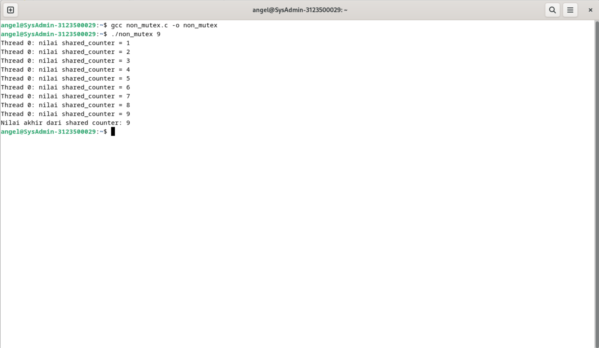
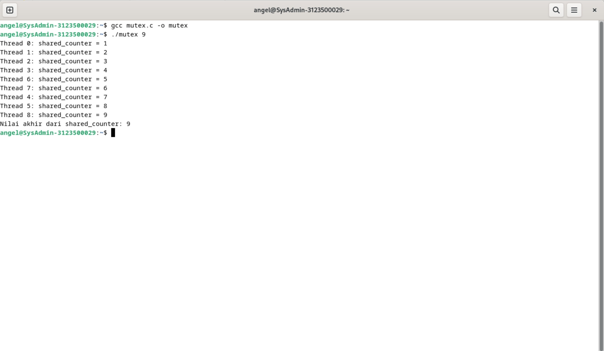

  <h1 style="font-weight: bold">PENGGUNAAN MUTEX</h1>
  <h4 style="text-align: center;">Dosen Pengampu : Dr. Ferry Astika Saputra, S.T., M.Sc.</h4>

 
 

  
  <h3 style="text-align: center;">Disusun Oleh : </h3>
  

    Firsty Angelica Valency (3123500029) 
  

  <h3 style="text-align: center;line-height: 1.5">Program Studi Teknik Informatika Departemen Teknik Informatika Dan Komputer Politeknik Elektronika Negeri Surabaya 2023/2024</h3>
  

# Daftar Isi
- [Daftar Isi](#daftar-isi)
- [Tugas Pendahuluan](#tugas-pendahuluan)
    - [SOAL 2](#soal-2)
    - [JAWABAN](#jawaban)
- [Kesimpulan](#kesimpulan)

# Tugas Pendahuluan

Buat analisa dari kedua program terlampir. Jelaskan penggunaan mutex pada program kedua!

### SOAL 2
- Source code
        
            // beri komentar
            #include <pthread.h>
            #include <stdio.h>
            #include <stdlib.h>

            // Global variable
            int shared_counter = 0;

            // beri komentar
            void *thread_function(void *thread_id)
            {
                //menginisiasi threat
                pthread_t tid = (pthread_t)thread_id;

                // Increment global var
                shared_counter++;

                // beri komentar
                printf("Thread %ld: nilai shared_counter = %d\n", (long)tid,
                    shared_counter);

                // beri komentar
                return NULL;
            }

            int main(int argc, char *argv[])
            {
                // beri komentar
                if (argc != 2)
                {
                    printf("Gunakan: %s <number_of_threads>\n", argv[0]);
                    exit(EXIT_FAILURE);
                }
                // mengambil nilai masukan jumlha dari thread melalui argumen
                int num_threads = atoi(argv[1]);

                // beri komentar
                pthread_t *threads = (pthread_t *)malloc(
                    num_threads * sizeof(pthread_t));

                // membuat threads
                for (int i = 0; i < num_threads; i++)
                {
                    int status = pthread_create(&threads[i], NULL,
                                                thread_function,
                                                (void *)threads[i]);
                    if (status != 0)
                    {
                        printf("Error: pthread_create() returned error "
                            "code %d\n",
                            status);
                        exit(EXIT_FAILURE);
                    }
                }

                // Wait for all threads to finish execution
                for (int i = 0; i < num_threads; i++)
                {
                    int status = pthread_join(threads[i], NULL);
                    if (status != 0)
                    {
                        printf("Error: pthread_join() returned error "
                            "code %d\n",
                            status);
                        exit(EXIT_FAILURE);
                    }
                }

                // Free the memory allocated for the thread IDs
                free(threads);

                // Print the final value of the shared counter
                printf("Nilai akhir dari shared counter: %d\n",
                    shared_counter);

                // Return success
                return 0;
            }

            --------------------------------------------------------------------------------------------------------------------

            #include <pthread.h>
            #include <stdio.h>
            #include <stdlib.h>

            int shared_counter = 0;

            pthread_mutex_t shared_counter_mutex = PTHREAD_MUTEX_INITIALIZER;

            void *thread_function(void *thread_id)
            {
                
                long tid = (long)thread_id;

            
                pthread_mutex_lock(&shared_counter_mutex);

                
                shared_counter++;

                printf("Thread %ld: shared_counter = %d\n", tid,
                    shared_counter);

                pthread_mutex_unlock(&shared_counter_mutex);

            
                return NULL;
            }

            int main(int argc, char *argv[])
            {
            
                if (argc != 2)
                {
                    printf("Penggunaan %s <number_of_threads>\n", argv[0]);
                    exit(EXIT_FAILURE);
                }

            
                int num_threads = atoi(argv[1]);

                pthread_t *threads = (pthread_t *)malloc(
                    num_threads * sizeof(pthread_t));

                for (int i = 0; i < num_threads; i++)
                {
                    int status = pthread_create(
                        &threads[i], NULL, thread_function, (void *)i);
                    if (status != 0)
                    {
                        printf("Error: pthread_create() returned error "
                            "code %d\n",
                            status);
                        exit(EXIT_FAILURE);
                    }
                }

            
                for (int i = 0; i < num_threads; i++)
                {
                    int status = pthread_join(threads[i], NULL);
                    if (status != 0)
                    {
                        printf("Error: pthread_join() returned error "
                            "code %d\n",
                            status);
                        exit(EXIT_FAILURE);
                    }
                }

                // Free the memory untuk thread IDs
                free(threads);

                
                printf("Nilai akhir dari shared_counter: %d\n",
                    shared_counter);

                // Return success
                return 0;

            }

### JAWABAN

A. Tanpa Mutex

Analisis:

Program ini memiliki variabel global shared_counter diinisialisasi dengan nilai 0. `void *thread_function(void *thread_id)` adalah fungsi yang akan dieksekusi oleh setiap thread. Us
er diminta untuk memasukan banyaknya thead saat menampilkan outoput program. `shared_counter++;` merupakan peningkatan counter ketika thread ditambahkan. Operasi ini tidak dilindungi oleh penguncian, sehingga masalah race condition dapat terjadi ketika beberapa thread mencoba untuk menginkrementasi variabel ini secara bersamaan. `int num_threads = atoi(argv[1]);` mengonversi argumen ke-2 (jumlah thread) dari string menjadi integer agar dapat dibaca oleh fungsi thread yang akan dimasukkan counter. 

B. Dengan Mutex

Analisis:

Sebuah mutex `shared_counter_mutex` dideklarasikan dan diinisialisasi menggunakan makro `PTHREAD_MUTEX_INITIALIZER.` yang digunakan untuk melindungi akses ke `shared_counter.` `pthread_mutex_unlock(&shared_counter_mutex);:` Mutex dibuka setelah selesai mengakses shared_counter. Sehingga CPU tidak mengalami rest condition dengan bantuan `pthread_mutex_lock(&shared_counter_mutex);:` Mutex dikunci sebelum mengakses dan memodifikasi `shared_counter`.

# Kesimpulan

Dengan menggunakan mutex, akses ke shared_counter dilindungi dari race condition. Hanya satu thread yang dapat mengakses shared_counter pada satu waktu, sehingga menjaga integritas data. Oleh karena itu, hasil dari shared_counter akan sesuai dengan ekspektasi tanpa race condition. Akan tetapi, jika tidak menggunakan variabel mutex maka shared_counter diakses dan dimodifikasi oleh beberapa thread secara bersamaan tanpa penguncian atau sinkronisasi dan pasti akan terjadi rest condition. 

Pada praktikum ini pada dua source code saya menginput nilai 9, dimana thread akan mengakses semua shared_counter hingga selesai pada metode mutex, sebaliknya code tanpa mutex terjadi race condition dimana akan membaca nilai yang sama sebelum penambahan dilakukan, sehingga thread-thread tersebut akan menambahkan nilai yang sama ke shared_counter. Tanpa mutex atau sinkronisasi lainnya, nilai shared_counter bisa menjadi tidak konsisten atau tidak benar.
