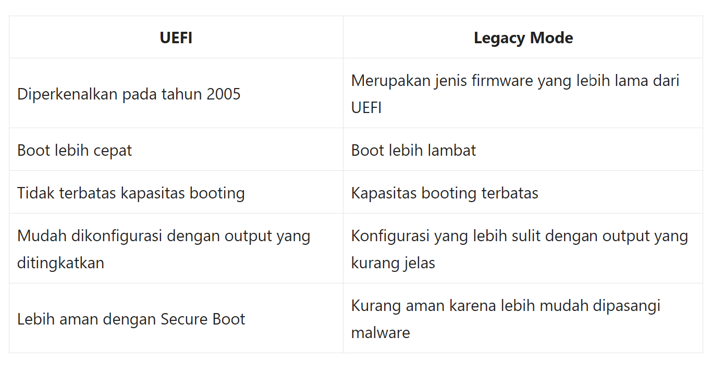
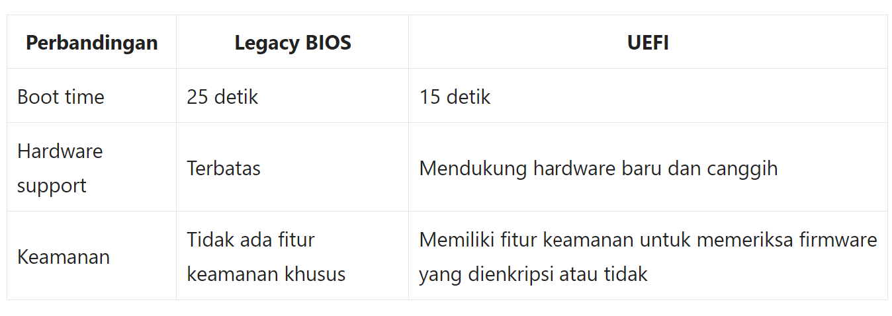
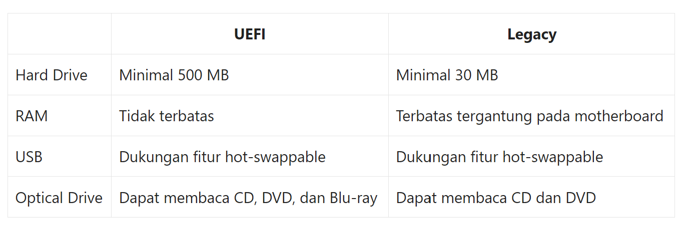

  <h1 style="font-weight: bold"> LAPORAN PRAKTIKUM II SISTEM OPERASI Perbedaan Legacy dan UEFI</h1>
  <h4 style="text-align: center;">Dosen Pengampu : Dr. Ferry Astika Saputra, S.T., M.Sc.</h4>

 
 

  
  <h3 style="text-align: center;">Disusun Oleh : </h3>
  

    Wildan Krisna Hakim (3123500002) 
    Firsty Angelica Valency (3123500029) 
    Hazel Mangadaralam Pratama Rayes (3123500024) 
  

  <h3 style="text-align: center;line-height: 1.5">Program Studi Teknik Informatika Departemen Teknik Informatika Dan Komputer Politeknik Elektronika Negeri Surabaya 2023/2024</h3>
  

# Daftar Isi
 - [Pendahuluan ](#pendahuluan)
 - [Perbedaan Legacy dan UEFI](#perbedaan-legacy-dan-uefi)
 - [Kesimpulan](#kesimpulan)
 - [Daftar Pustaka](#daftar-pustaka)

# Pendahuluan
Banyak pengguna Windows yang masih bingung  memilih antara mode Legacy BIOS dan UEFI saat menginstal sistem operasi.
Untuk memahami istilah BIOS dan UEFI, kita  harus  terlebih dahulu memahami perbedaan kedua istilah  yang  dibahas pada ulasan kali ini.  
Kedua jenis BIOS ini adalah tabel partisi yang digunakan untuk menjalankan perangkat keras dan perangkat lunak komputer.

## Definisi Legacy
**Apa itu Legacy ?**
 
**Legacy** adalah Sistem warisan atau sistem peninggalan (bahasa Inggris: legacy system) yang merupakan **metode sistem komputasi lawas atau yang sudah tua** di teknologi sistem komputer atau program aplikasi dari yang berkaitan dengan sistem komputer tua yang sudah tertinggal zaman. Namun saat ini sistem legacy masih digunakan untuk menjalankan program atau sistem operasi lawas.

## Definisi UEFI
**Apa itu UEFI**
 
**UEFI** singkatan dari **Unified Extensible Firmware Interface.** UEFI adalah pembaruan teknologi terbaru dari BIOS yang berfungsi **mengupdate fungsi BIOS yang sudah ketinggalan zaman.** UEFI hadir untuk mengatasi permasalahan BIOS yang sudah ketinggalan zaman. 

# Perbedaan Legacy dan UEFI

- Flowchart Boot
  

BIOS (Basic Input/Output System)

BIOS adalah firmware lawas yang sudah ada sejak lama. Fungsinya untuk melakukan pengecekan awal perangkat keras (POST - Power-On Self Test) dan memuat bootloader sistem operasi. Proses booting BIOS umumnya terdiri dari langkah berikut:

POST: BIOS menyalakan komponen komputer dan melakukan pemeriksaan dasar untuk memastikan semuanya berfungsi dengan baik.
Pencarian Bootloader: BIOS mencari program bootstrap loader pada penyimpanan, biasanya di Master Boot Record (MBR) pada sektor pertama harddisk.
Pemuatan Bootloader: BIOS memuat bootloader ke dalam memori.
Penyerahan Kendali: Bootloader mengambil alih kendali dan memuat sistem operasi dari penyimpanan.
UEFI (Unified Extensible Firmware Interface)

UEFI adalah antarmuka firmware yang lebih baru dan canggih dibanding BIOS. UEFI menawarkan beberapa kelebihan seperti:

Antarmuka Grafis: UEFI umumnya memiliki antarmuka pengguna grafis dengan dukungan mouse dan keyboard, memudahkan navigasi pengaturan.
Booting Cepat: UEFI berjalan pada mode prosesor 32-bit atau 64-bit, sehingga proses booting lebih cepat dibanding BIOS yang terbatas pada mode 16-bit.
Dukungan Harddisk Besar: UEFI mendukung kapasitas harddisk lebih dari 2 TB, sementara BIOS terbatas pada 2 TB menggunakan skema partisi MBR.
Fitur Keamanan: UEFI memiliki fitur keamanan tambahan seperti Secure Boot yang membantu mencegah booting dari perangkat yang tidak sah.
Proses booting UEFI secara garis besar mirip dengan BIOS, namun dengan beberapa perbedaan:

POST: Sama seperti BIOS, UEFI melakukan POST untuk memeriksa perangkat keras.
UEFI Firmware: Alih-alih langsung mencari bootloader, UEFI memuat driver dan layanan tambahan dari partisi khusus pada harddisk yang disebut EFI System Partition (ESP).
Boot Manager: UEFI menggunakan Boot Manager untuk memuat bootloader sistem operasi yang sesuai, bisa dari penyimpanan lokal atau jaringan.
Penyerahan Kendali: Bootloader dimuat ke memori dan mengambil alih kendali untuk menjalankan sistem operasi.

**Firmware**
 
Untuk lebih memahami perbedaan antara UEFI dan BIOS, berikut adalah tabel **perbandingan untuk kedua jenis firmware (perangkat lunak yang digunakan untuk menghubungkan sistem operasi dengan bagian hardware dari sebuah komputer)**.

**Performa**
 
UEFI dan Legacy BIOS memiliki perbedaan performa yang signifikan. Berikut adalah beberapa perbandingan antara keduanya:

**Kompatibilitas Perangkat keras**
 

# Kesimpulan
- UEFI sudah mendukung kapasitas penyimpanan hardisk lebih dari 2 TB, sedangkan pada BIOS maksimal adalah 2 TB.
- UEFI sudah mendukung tipe partisi GPT yang diwajibkan pada saat melakukan instalasi sistem operasi terbaru khususnya Windows 10/Linux, Sedangkan BIOS hanya dapat menjalankan tipe partisi MBR atau Master Boot Record.
Sudah memungkinkan untuk menggunakan touchpad, mouse, bahkan touchscreen saat berada didalam UEFI, sedangkan pada BIOS hanya menggunakan keyboard.
- Tampilan User Interface pada UEFI sudah jauh lebih menarik dan user friendly dari pada BIOS yang masih menggunakan mode display standar
Jika menggunakan UEFI + sistem partisi GPT maka kamu lebih mudah mengelola bootloader pad a komputer dengan dualboot/triple boot

Jadi, meskipun Legacy Mode masih digunakan, UEFI merupakan teknologi yang lebih inovatif dan ramah pengguna. UEFI dapat diandalkan untuk mem-boot sistem dengan kecepatan boot yang lebih cepat dan kapasitas booting yang lebih besar.

# Daftar Pustaka
- https://blog.dimensidata.com/pengertian-dan-perbedaan-uefi-dan-legacy-pada-bios/
- https://www.localstartupfest.id/faq/perbedaan-uefi-dan-legacy/
- https://dianisa.com/perbedaan-legacy-bios-dan-uefi/#google_vignette
- https://p2k.stekom.ac.id/ensiklopedia/Sistem_legacy
- https://www.perbedaan.co.id/perbedaan-uefi-dan-legacy/
