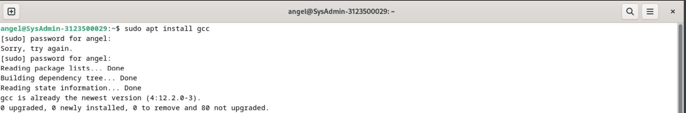
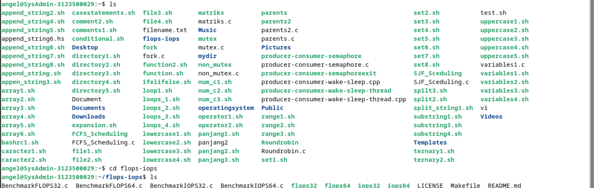
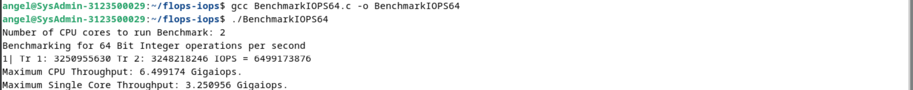

  <h1 style="font-weight: bold"> LAPORAN PRAKTIKUM III SISTEM OPERASI  Iops Dan Flops</h1>
  <h4 style="text-align: center;">Dosen Pengampu : Dr. Ferry Astika Saputra, S.T., M.Sc.</h4>

 
 

  
  <h3 style="text-align: center;">Disusun Oleh : </h3>
  

    Wildan Krisna Hakim (3123500002) 
    Firsty Angelica Valency (3123500029) 
    Hazel Mangadaralam Pratama Rayes (3123500024) 
  

  <h3 style="text-align: center;line-height: 1.5">Program Studi Teknik Informatika Departemen Teknik Informatika Dan Komputer Politeknik Elektronika Negeri Surabaya 2023/2024</h3>
  

            
            
<h2 align="center"> Iops Dan Flops</h2>

<h3>Iops</h3>

IOPS adalah jumlah permintaan yang dikirim aplikasi Anda ke disk penyimpanan dalam satu detik.

<h3>Flops</h3>

FLOPS adalah singkatan dari istilah dalam bahasa Inggris Floating point Operations Per Second yang merujuk pada satuan untuk jumlah perhitungan yang dapat dilakukan oleh sebuah perangkat komputasi (dalam hal ini adalah komputer) terhadap bilangan pecahan (floating point) tiap satu satuan waktu.

<h2 align="center">Melakukan Benchmarking pada CPU</h2>

**1. Melakukan Instalasi Package GCC,Make dan Git pada Debian 12 yang sudah terinstall**

Lakukan perintah "$ sudo apt update" pada terminal kemudian ketik "$ sudo apt install gcc" untuk menginstall compile dan "$ sudo apt install git" untuk menginstall git pada debian

**2. Melakukan Git clone pada Debian 12**

Arahkan direktori pada terminal yang ingin dituju lalu ketik "$ git clone (paste link github) lalu tekan enter

**3. Melakukan Pengecekan clone didalam directory**

**4. Melakukan Proses Benchmarking menggunakan Iops dan Flops**

Melakukan Runing Program BrenchmarkFLOPS64.c dengan memasukkan CPU cores = 2

Melakukan Runing Program BrenchmarkIOPS64.c dengan memasukkan CPU cores = 2

<h2 align="center">Analisa Hasil Benchmarking</h2>

|                        | IOPS64 (Integer)         | FLOPS64 (Floating Point)    |
|----------------------  |------------------------  |-----------------------------|
| Total Throughput       | 6.499174 Gigaiops       |     15.161046 Gigaiops      |
| Single Core Throughput | 3.250956 Gigaflops       |     7.582623 Gigaflops       |

Dengan melihat tabel di atas, dapat dilihat bahwa FLOPS memiliki total throughput dan throughput single core yang lebih tinggi dibandingkan dengan IOPS. Namun demikian, perbedaan antara total throughput dan throughput single core juga penting untuk diperhatikan karena menunjukkan seberapa baik CPU dapat mengalokasikan dan memanfaatkan sumber daya secara efisien antara inti tunggal dan total throughput.

# KESIMPULAN
IOPS (Input/Output Operations Per Second) dan FLOPS (Floating Point Operations Per Second) menunjukkan bahwa:

- IOPS memiliki throughput lebih tinggi: IOPS mampu melakukan lebih banyak operasi masukan/keluaran per detik daripada FLOPS.
- Perbedaan antara total throughput dan throughput single core: Perbedaan ini mencerminkan efisiensi CPU dalam mengalokasikan sumber daya antara inti tunggal dan total throughput. Semakin kecil perbedaannya, semakin baik CPU dapat mendistribusikan beban kerja di antara inti-inti yang tersedia.
- Implikasi kinerja: Meskipun IOPS memiliki throughput lebih tinggi, penting untuk mempertimbangkan jenis operasi yang dilakukan oleh aplikasi atau beban kerja. FLOPS lebih penting jika aplikasi bergantung pada operasi floating point, sementara IOPS menjadi lebih relevan untuk operasi masukan/keluaran

**REFERENSI** 

[MICROSOFT IOPS](https://learn.microsoft.com/id-id/azure/virtual-machines/premium-storage-performance)

[WIKIPEDIA FLOPS](https://id.wikipedia.org/wiki/FLOPS)

