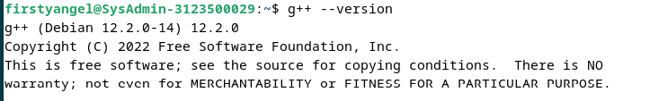

  <h1 style="font-weight: bold"> LAPORAN PRAKTIKUM V SISTEM OPERASI Proses dan Manajemen Proses</h1>
  <h4 style="text-align: center;">Dosen Pengampu : Dr. Ferry Astika Saputra, S.T., M.Sc.</h4>

 
 

  
  <h3 style="text-align: center;">Disusun Oleh : </h3>
  

    Firsty Angelica Valency (3123500029) 
  

  <h3 style="text-align: center;line-height: 1.5">Program Studi Teknik Informatika Departemen Teknik Informatika Dan Komputer Politeknik Elektronika Negeri Surabaya 2023/2024</h3>
  

# Daftar Isi
- [Pendahuluan](#pendahuluan)
- [Tugas Pendahuluan](#Tugas_pendahuluan)
- [Percobaan](#percobaan)
- [Kesimpulan](#kesimpulan)
- [Daftar Pustaka](#daftaar-pustaka)

# Pendahuluan

## Dasar Teori
### 1.  Konsep Proses Pada Sistem Operasi Linux
Proses adalah program yang sedang dieksekusi. Setiap kali menggunakan utilitas sistem atau program aplikasi dari shell, satu atau lebih proses ”child” akan dibuat oleh shell sesuai perintah yang diberikan. Setiap kali instruksi dibe rikan pada Linux shell, maka kernel akan menciptakan sebuah proses-id. Proses ini disebut juga dengan terminology Unix sebagai sebuah Job.   Proses Id (PID) dimulai dari 0, yaitu proses INIT, kemudian diikuti oleh proses berikutnya (terdaftar pada /etc/inittab). 
 Beberapa tipe proses :
 
 
•	Foreground
Proses yang diciptakan oleh pemakai langsung pada terminal (interaktif, dialog)
 
 
•	Batch
Proses yang dikumpulkan dan dijalankan secara sekuensial (satu persatu).   Prose Batch tidak diasosiasikan (berinteraksi) dengan terminal.
 
 
•	Daemon
Proses yang menunggu permintaan (request) dari proses lainnya dan menjalankan tugas sesuai dengan permintaan tersebut. Bila tidak ada request, maka program ini akan berada dalam kondisi “idle” dan tidak menggunakan waktu hitung CPU. Umumnya nama proses daemon di UNIX berakhiran d, misalnya inetd, named, popd dll

###  2. Sinyal
Proses dapat mengirim dan menerima sinyal dari dan ke proses lainnya. Proses mengirim sinyal melalui instruksi “kill” dengan format
kill [-nomor sinyal] PID
Nomor sinyal : 1 s/d maksimum nomor sinyal yang didefinisikan system Standar nomor sinyal yang terpenting adalah :
 
 

|                 No  Sinyal   |  Nama     | Deskripsi    |
|----------------------|------------------------|---------------------------|
| 1  | SIGHUP    | Hangup, sinyal dikirim bila proses terputus, misalnya melalui putusnya hubungan modern |
| 2 | SIGINT  |    Sinyal interrupt, melalui ^C   |
| 3 |  SIGQUIT  |  Sinyal Quit, melalui ^\    |
| 9 |  SIGKILL  |  9	SIGKILL	Sinyal Kill, menghentikan proses   |
| 15 |  SIGTERM | Sinyal terminasi software   |

### 3. Mengirim Sinyal

Shell menyediakan fasilitas job control yang memungkinkan mengontrol beberapa job atau proses yang sedang berjalan pada waktu yang sama. Misalnya bila melakukan pengeditan file teks dan ingin melakukan interrupt pengeditan untuk mengerjakan hal lainnya. Bila selesai, dapat kembali (switch) ke editor dan melakukan pengeditan file teks kembali.
Job bekerja pada foreground atau background. Pada foreground hanya diper untukkan untuk satu job pada satu waktu. Job pada foreground akan mengontrol shell - menerima input dari keyboard dan mengirim output ke layar. Job pada background tidak menerima input dari terminal, biasanya berjalan tanpa memerlukan interaksi.
Job pada foreground kemungkinan dihentikan sementara (suspend), dengan menekan [Ctrl-Z]. Job yang dihentikan sementara dapat dijalankan kembali pada foreground atau background sesuai keperluan dengan menekan ”fg” atau ”bg ”. Sebagai catatan, menghentikan job seme ntara sangat berbeda dengan melakuakan interrupt job (biasanya menggunakan [Ctrl-C]), dimana job yang diinterrup akan dimatikan secara permanen dan tidak dapat dijalankan lagi.

### 5. Mengontrol proses Lain

Perintah ps dapat digunakan untuk menunjukkan semua proses yang sedang berjalan pada mesin (bukan hanya proses pada shell saat ini) dengan format :
ps –fae atau
ps -aux
Beberapa versi UNIX mempunyai utilitas sistem yang disebut top yang menyediakan cara interaktif untuk memonitor aktifitas sistem. Statistik secara detail
 

dengan proses yang berjalan ditampilkan dan secara terus-menerus di-refresh . Proses ditampilkan secara terurut dari utilitas CPU. Kunci yang berguna pada top adalah
s – set update frequency
u – display proses dari satu user
k – kill proses (dengan PID)
q – quit
Utilitas untuk melakukan pengontrolan proses dapat ditemukan pada sistem UNIX adalah perintah killall. Perintah ini akan menghentikan proses sesuai PID atau job number proses.

# Tugas Pendahuluan
Jawablah pertanyaan-pertanyaan di bawah ini :
1.	Apa yang dimaksud dengan proses ? 
Jawab: Program yang sedang diekssekusi atau dijalankan oleh CPU 

2.	Apa yang dimaksud perintah untuk menampilkan status proses :
ps, pstree. 
Jawab: perintah ps menampilkan proses di linux yang berupa: 
* PID: nomor identifikasi proses.

* TTY: Nama konsol tempat pengguna masuk.

* WAKTU: Jumlah waktu CPU yang digunakan proses.

* CMD: nama perintah yang memulai proses

Sedangkan pstree merupakan perintah untuk menampilkan pstree menampilkan struktur hierarki pohon dari semua proses yang berjalan. 

3.	Sebutkan opsi yang dapat diberikan pada perintah ps 
Jawab: Perintah menampilkan ps yaitu :
* -e : digunakan untuk melakukan semua proses
* -C : digunakan untuk menyaring proses berdasarkan nama / perintah
* -f : digunakan untuk menampilkan semua informasi secara lengkap.
* -r : digunakan untuk menampilkan proses yang sedang berjalan
* -u : digunakan untuk menampilkan proses pada user tertentu saja. Biasanya diikuti dengan menggunakan nama user yang ingin dilihat prosesnya
* -o : digunakan untuk menampilkan proses yang menggunakan kata kunci tertentu saja
* -aux dan -fae : melihat informasi proses secara keseluruhan
* -pid : digunakan untuk menampilkan informasi proses berdasarkan Process ID (PID)
* -ppid : menampilkan ID proses dari proses yang membuat proses yang sedang berjalan

4.	Apa yang dimaksud dengan sinyal ? Apa perintah untuk mengirim sinyal ?  
Jawab: Sinyal data atau informasi yang sudah mengalami beberapa proses sedemikian rupa hingga akhirnya menjadi sebuah informasi matang untuk dikirim ke pihak penerima. Proses dapat mengirim dan menerima sinyal dari dan ke proses lainnya. Proses mengirim sinyal melalui instruksi “kill” dengan format
kill [-nomor sinyal] PID

5.	Apa yang dimaksud dengan proses foreground dan background pada job control ? 
Jawab: 
* forehand: mengontrol shell - menerima input dari keyboard dan mengirim output ke layar
* Background: tidak menerima input dari terminal, biasanya berjalan tanpa memerlukan interaksi

6.	Apa yang dimaksud perintah-perintah penjadwalan prioritas :  
top, nice, renice.  
Jawab: 
* top: menampilkan daftar proses yang sedang berjalan secara real-time beserta informasi terkait penggunaan sumber daya seperti CPU, memori, dan lainnya
* nice : melihat proses mana yang memakan sumber daya yang paling banyak, sehingga dapat membantu dalam mengidentifikasi proses-proses yang membutuhkan perhatian khusus dengan memberikan nilai (biasanya dari -20 hingga 19) yang menentukan prioritas proses tersebut. Semakin rendah nilai yang diberikan, semakin tinggi prioritasnya.
* renice : digunakan untuk mengubah prioritas proses yang sedang berjalan 
dengan menyesuaikan prioritas proses yang sudah berjalan dengan memberikan nilai prioritas baru 
yang dilakukan setelah proses telah dimulai untuk memodifikasikan prioritasnya sesuai kebutuhan
 

# Percobaan
1.	Login sebagai user.
2.	Download program   C++   untuk   menampilkan   bilangan   prima   yang   bernama
primes.
3.	Lakukan percobaan-percobaan di bawah ini kemudian analisa hasil percobaan.
4.	Selesaikan soal-soal latihan.

## Hasil Percobaan
1. Login

2. Download program C++ untuk   menampilkan   bilangan   prima   yang   bernama
primes.

 
Analisis: g++ adalah compiler untuk pemograman bahasa c++ agar dapat ditampilkan dilayar yang dilakukan dengan perintah sudo apt-get install g++.

 
Analisis: g++ --version merupakan perintah untuk menampilkan versi dari g++ yang telah diinstall sebelumnya

 
Analisis: cd directory dilakukan untuk mengakses Desktop folder yang akan diisi oleh file c++ bernama primes.cpp

 
Analisis: Untuk menampilkan outputnya digunakan perintah g++ primes.cpp -o primes dimana -o primes adalah nama executable filenya lalu file tersebut dijalankan dengan perintah ./prime

3. Lakukan percobaan-percobaan di bawah ini kemudian analisa hasil percobaan.

#### Percobaan 1

 
Analisis: Perintah ps menampilkan daftar semua proses yang berjalan saat ini

 
Analisis: Perintah ps-u menampilkan daftar semua proses yang berjalan di sistem beserta informasi pengguna terkait

 
Analisis: menampilkan daftar proses yang dimiliki pengguna tertentu (username) beserta informasi penggunanya.

 
Analisis: Perintah ps -a hanya  menampilkan daftar proses tanpa informasi tambahan tentang pemilik proses

 
Analisis: ps -au menampilkan daftar proses denfan menyertakan informasi pengguna disetiap proses

#### Percobaan 2

 
Analisis: Perintah ps -eH digunakan untuk melihat daftar proses yang berjalan di sistem dan disusun dalam bentuk hirarki dimana bagan tersebut saling berhubungan

 
Analisis: ps -ef menampilkan semua proses yang berjalan disistem dengan informasi lengkapnya

 
Analisis: pstree digunakan untuk menampilkan struktur pohon proses dari sistem secara hierarkis yang dimulai dari proses induk utama seperti systemd, dan kemudian turun ke proses-proses anak yang lebih spesifik.

 
Analisis: pstree | grep mingetty
digunakan untuk memfilter struktur pohon pada perintah pstree dengan hanya menampilkan baris yang mengandung kata "mingetty"

 
Analisis: pstree -p menampilkan struktur pohon dengan menambahkan nomor PID (Proses ID) setiap proses.

 
Analisis:pstree -h digunakan untuk menampilkan struktur pohon proses seperti yang dilakukan oleh pstree, tetapi dengan menggunakan indentasi yang disesuaikan untuk setiap level dalam hierarki proses sehingga memudahkan untuk memahami hubungan parent-child antara proses-proses terse

#### Percobaan 3

 
Analisis: ps -e | more menampilkan daftar semua proses dimana jika ditambah dengan perintah more akan ditampilkan satu halaman

 
Analisis: ps-ax-more manampilkan daftar proses secara bertahap

 
Analisis: ps -ef digunakan untuk  menampilkan daftar semua proses yang berjalan di sistem, bersama dengan informasi lengkap tentang setiap proses, seperti UID (User ID), PID (Process ID), PPID (Parent Process ID), TTY (controlling terminal), STAT (status), TIME (CPU time), dan CMD (command) secara bertahap

 
Analisis:ps -eo pid cmd digunakan untuk menampilkan daftar semua proses yang berjalan di sistem, dengan menampilkan hanya PID (Process ID) dan perintah (cmd) yang menjalankan proses tersebut

 
Analisis: ps -eo,pid,ppid,%mem,cmd | more digunakan untuk menampilkan daftar semua proses yang berjalan di sistem, dengan menampilkan hanya kolom PID (Process ID), PPID (Parent Process ID), %MEM (persentase memori yang digunakan oleh proses), dan CMD (command) yang menjalankan proses tersebut

#### Percobaan 4 

 
Analisis: perintah yes akan menampilkan y tanpa henti

 
Analisis: 
* yes > /dev/null & digunakan untuk membuat proses yang secara terus menerus akan menghasilkan output 'y' (ya) dan mengalirkan output tersebut ke /dev/null. & diakhir perintah menandakan agar proses tersebut berjalan di latar belakang (background), sehingga Anda dapat melanjutkan menggunakan terminal tanpa harus menunggu proses tersebut selesai.

* jobs digunakan di dalam shell untuk menampilkan daftar pekerjaan (jobs) yang sedang berjalan di latar belakang (background) atau berhenti (stopped) dalam sesi shell saat in

* Perintah kill %1 digunakan untuk mengirim sinyal "terminasi" (default: SIGTERM) ke pekerjaan (job) dengan nomor identifikasi (ID) 1 yang sedang berjalan di latar belakang (background) dalam sesi shell dimana 1 merupakan pekerjaan pertama yang dimulai di backgroud

# Kesimpulan 
perintah ps pada sistem Linux digunakan untuk menampilkan informasi tentang proses-proses yang sedang berjalan di sistem Linux.

# Daftar Pustaka
* https://id.linux-console.net/?p=8561#gsc.tab=0
