

  <h1 style="font-weight: bold"> LAPORAN PRAKTIKUM VI SISTEM OPERASI Proses dan Manajemen Proses</h1>
  <h4 style="text-align: center;">Dosen Pengampu : Dr. Ferry Astika Saputra, S.T., M.Sc.</h4>

 
 

  
  <h3 style="text-align: center;">Disusun Oleh : </h3>
  

    Firsty Angelica Valency (3123500029) 
  

  <h3 style="text-align: center;line-height: 1.5">Program Studi Teknik Informatika Departemen Teknik Informatika Dan Komputer Politeknik Elektronika Negeri Surabaya 2023/2024</h3>
  

# Daftar Isi
- [Pendahuluan](#pendahuluan)
- [Percobaan](#percobaan)
- [Tugas Pendahuluan](#Tugas_pendahuluan)
- [Kesimpulan](#kesimpulan)

# Pendahuluan
## Dasar Teori
# Pendahuluan

## Dasar Teori
### 1.  Konsep Proses Pada Sistem Operasi Linux
Proses adalah program yang sedang dieksekusi. Setiap kali menggunakan utilitas sistem atau program aplikasi dari shell, satu atau lebih proses ”child” akan dibuat oleh shell sesuai perintah yang diberikan. Setiap kali instruksi dibe rikan pada Linux shell, maka kernel akan menciptakan sebuah proses-id. Proses ini disebut juga dengan terminology Unix sebagai sebuah Job.   Proses Id (PID) dimulai dari 0, yaitu proses INIT, kemudian diikuti oleh proses berikutnya (terdaftar pada /etc/inittab). 
 Beberapa tipe proses :
 
 
•	Foreground
Proses yang diciptakan oleh pemakai langsung pada terminal (interaktif, dialog)
 
 
•	Batch
Proses yang dikumpulkan dan dijalankan secara sekuensial (satu persatu).   Prose Batch tidak diasosiasikan (berinteraksi) dengan terminal.
 
 
•	Daemon
Proses yang menunggu permintaan (request) dari proses lainnya dan menjalankan tugas sesuai dengan permintaan tersebut. Bila tidak ada request, maka program ini akan berada dalam kondisi “idle” dan tidak menggunakan waktu hitung CPU. Umumnya nama proses daemon di UNIX berakhiran d, misalnya inetd, named, popd dll

###  2. Sinyal
Proses dapat mengirim dan menerima sinyal dari dan ke proses lainnya. Proses mengirim sinyal melalui instruksi “kill” dengan format
kill [-nomor sinyal] PID
Nomor sinyal : 1 s/d maksimum nomor sinyal yang didefinisikan system Standar nomor sinyal yang terpenting adalah :
 
 

|                 No  Sinyal   |  Nama     | Deskripsi    |
|----------------------|------------------------|---------------------------|
| 1  | SIGHUP    | Hangup, sinyal dikirim bila proses terputus, misalnya melalui putusnya hubungan modern |
| 2 | SIGINT  |    Sinyal interrupt, melalui ^C   |
| 3 |  SIGQUIT  |  Sinyal Quit, melalui ^\    |
| 9 |  SIGKILL  |  9	SIGKILL	Sinyal Kill, menghentikan proses   |
| 15 |  SIGTERM | Sinyal terminasi software   |

### 3. Mengirim Sinyal

Shell menyediakan fasilitas job control yang memungkinkan mengontrol beberapa job atau proses yang sedang berjalan pada waktu yang sama. Misalnya bila melakukan pengeditan file teks dan ingin melakukan interrupt pengeditan untuk mengerjakan hal lainnya. Bila selesai, dapat kembali (switch) ke editor dan melakukan pengeditan file teks kembali.
Job bekerja pada foreground atau background. Pada foreground hanya diper untukkan untuk satu job pada satu waktu. Job pada foreground akan mengontrol shell - menerima input dari keyboard dan mengirim output ke layar. Job pada background tidak menerima input dari terminal, biasanya berjalan tanpa memerlukan interaksi.
Job pada foreground kemungkinan dihentikan sementara (suspend), dengan menekan [Ctrl-Z]. Job yang dihentikan sementara dapat dijalankan kembali pada foreground atau background sesuai keperluan dengan menekan ”fg” atau ”bg ”. Sebagai catatan, menghentikan job seme ntara sangat berbeda dengan melakuakan interrupt job (biasanya menggunakan [Ctrl-C]), dimana job yang diinterrup akan dimatikan secara permanen dan tidak dapat dijalankan lagi.

### 5. Mengontrol proses Lain

Perintah ps dapat digunakan untuk menunjukkan semua proses yang sedang berjalan pada mesin (bukan hanya proses pada shell saat ini) dengan format :
ps –fae atau
ps -aux
Beberapa versi UNIX mempunyai utilitas sistem yang disebut top yang menyediakan cara interaktif untuk memonitor aktifitas sistem. Statistik secara detail
 

dengan proses yang berjalan ditampilkan dan secara terus-menerus di-refresh . Proses ditampilkan secara terurut dari utilitas CPU. Kunci yang berguna pada top adalah
s – set update frequency
u – display proses dari satu user
k – kill proses (dengan PID)
q – quit
Utilitas untuk melakukan pengontrolan proses dapat ditemukan pada sistem UNIX adalah perintah killall. Perintah ini akan menghentikan proses sesuai PID atau job number proses.

# Percobaan

## Percobaan 5 : Menghentikan dan memulai kembali job

1. Cara lain meletakkan job pada background dengan memulai job secara normal (pada foreground), stop job dan memulai lagi pada background. `$ yes > /dev/null` Hentikan sementara job (suspend), bukan menghentikannya (terminate), tetapi menghentikan sementara job sampai di restart. Untuk menghentikan sementara job gunakan Ctrl-Z.

    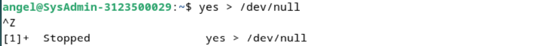

2. Untuk restart job pada foreground , gunakan perintah fg.`$ fg`

    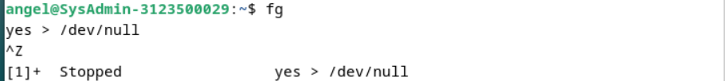 

3. Shell akan menampilkan nama perintah yang diletakkan di foreground . Stop job lagi dengan Ctrl-Z. Kemudian gunakan perintah bg untuk meletakkan job pada background . `$ bg`

    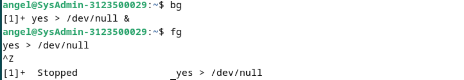 

    Job tidak bisa dihentikan dengan Ctrl-Z karena job berada pada background. Untuk menghentikannya, letakkan job pada foreground dengan fg dan kemudian hentikan sementara dengan Ctrl-Z.
    `$ fg`

4. Job pada background dapat digunakan untuk menampilkan teks pada terminal, dimana dapat diabaikan jika mencoba mengerjakan job lain.`$ yes &`

     
    
5. Apabila ingin menjalankan banyak job dalam satu waktu, letakkan job pada foreground atau background dengan memberikan job ID.

    ` $ fg %2`   atau   `$ %2`
     
    `$ bg %2`
    

6.	tekan fg dan tekan Enter, kemudian dilanjutkan dengan Ctrl -Z untuk menghentikan sementara.

7.	Lihat job dengan perintah ps -fae dan tekan Enter. Kemudian hentikan proses dengan perintah kill. 
    `$ ps -fae`
    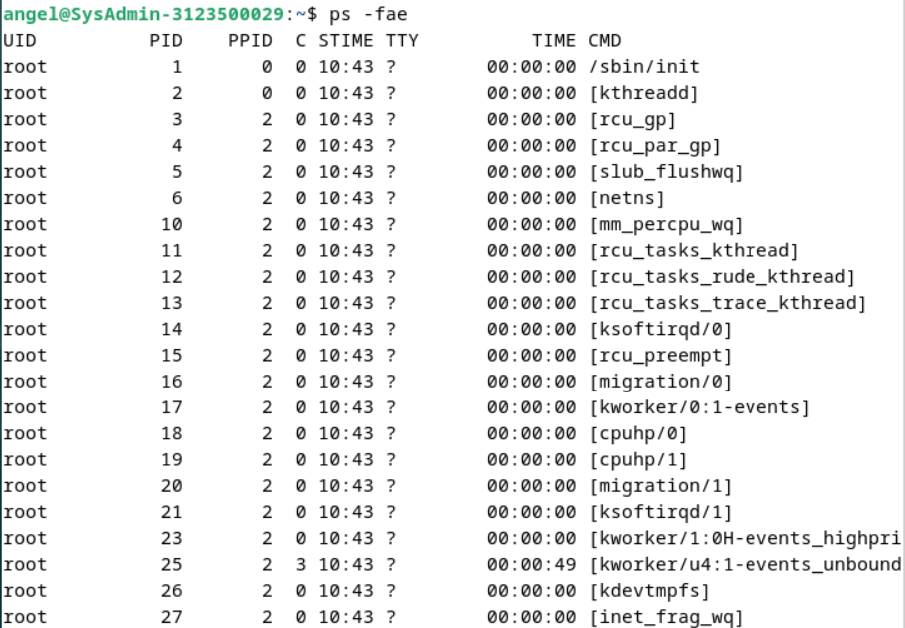 
   
    `$ kill -9 <NomorPID>`

    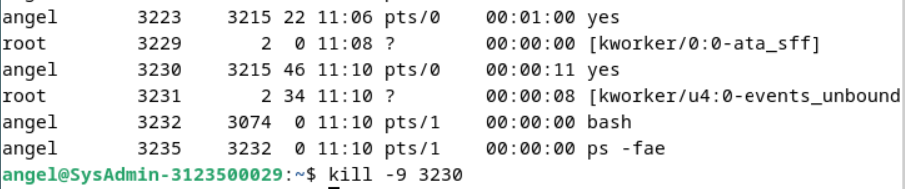 

    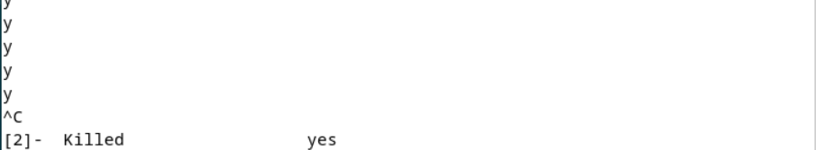 

## Percobaan 6

1.	Login sebagai root.
2.	Buka 3 terminal, tampilkan pada screen yang sama.
    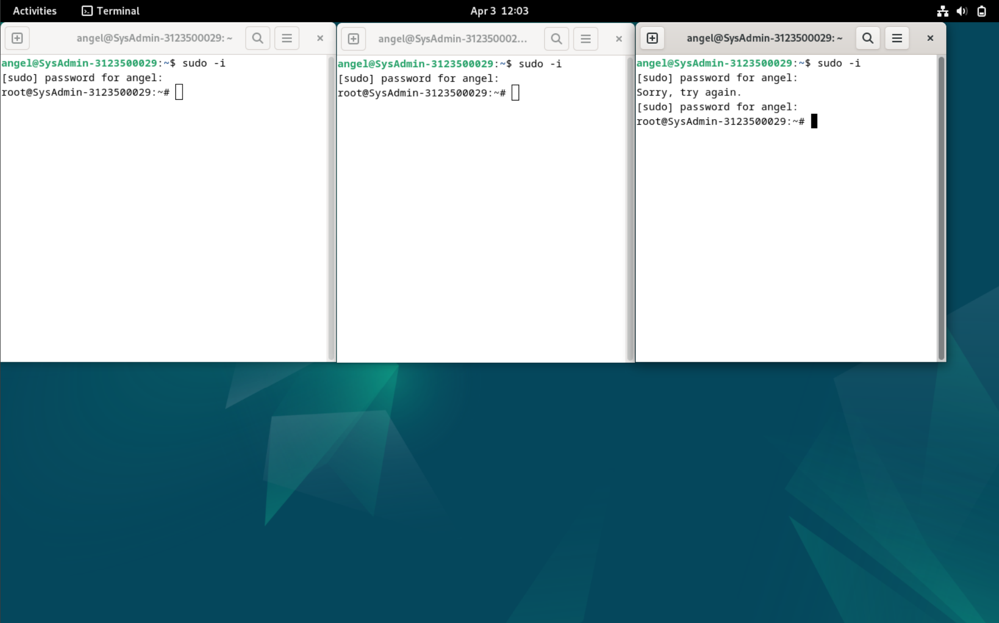
3.	Pada setiap terminal, ketik PS1 = ” \w:” diikuti Enter. \w menampilkan path pada direktori home.
4.	Karena login sebagai root, maka akan ditampilkan ~: pada setiap terminal. Untuk setiap terminal ketik pwd dan tekan Enter untuk melihat bahwa Anda sedang berada pada direktori /root.
    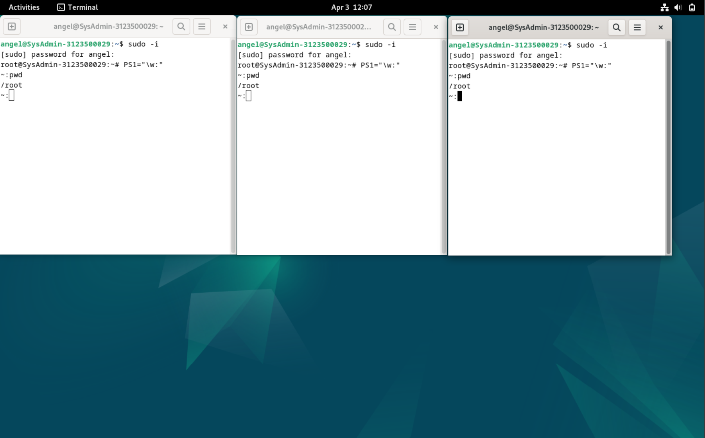
5.	Buka terminal lagi (keempat), atur posisi sehingga keempat terminal terlihat
pada screen.
6. Pada terminal keempat, ketik top dan tekan Enter. Maka program   top akan muncul. Ketik i. Top akan menampilkan proses yang aktif. Ketik lmt. Top tidak lagi menampilkan informasi pada bagian atas dari screen. Pada percobaan ini, terminal ke empat sebagai jendela Top

    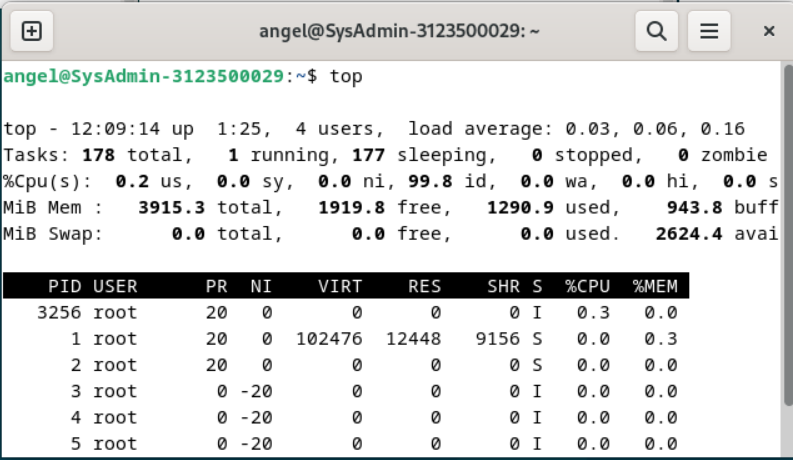

    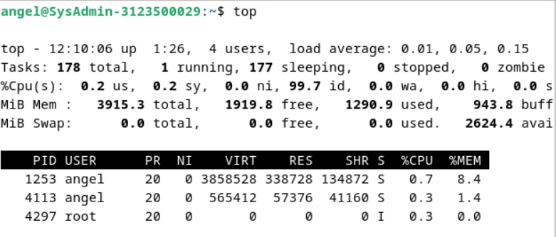

    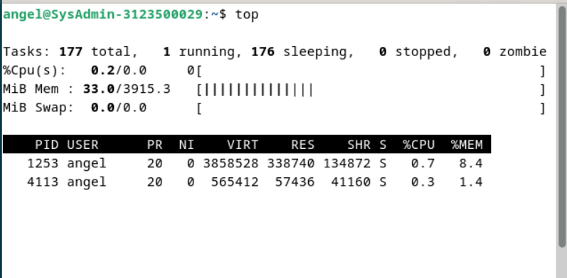

7. Pada terminal 1, bukalah program executable C++ dengan mengetik program yes dan tekan Enter

   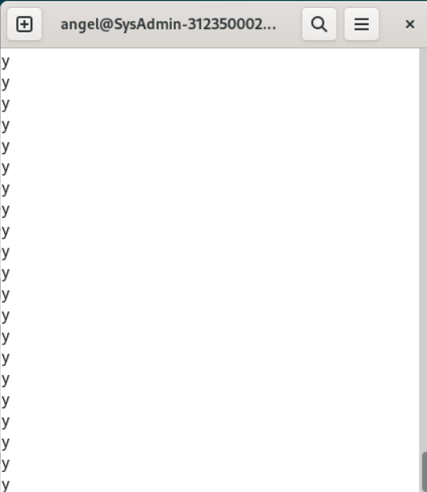

9.	Ulangi langkah 7 untuk terminal 2.

    

10.	Jendela Top akan menampilkan dua program yes sebagai proses yang berjalan. Nilai %CPU sama pada keduanya. Hal ini berarti kedua proses mengkonsumsi waktu proses yang sama dan berjalan sama cepat. PID dari kedua proses akan berbeda, misalnya 3148 dan 3149. Kemudian gunakan terminal 3 (yang tidak menjalankan primes maupun Jendela Top) dan ketik `renice 19 <PID terimnal 1>` (contoh : renice 19 3148) dan diikuti Enter. Hal ini berarti mengganti penjadwalan prioritas dari proses ke 19.
     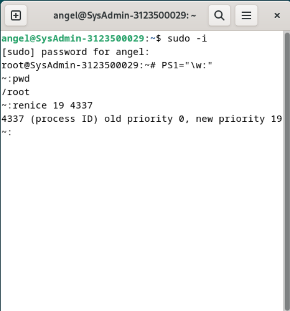

11.	Tunggu beberapa saat sampai program top berubah dan terlihat pada jendela Top. Pada kolom STAT memperlihatkan N untuk proses 3148. Hal ini berarti bahwa penjadwalan prioritas untuk proses 3148 lebih besar (lebih lambat) dari 0. Proses 3149 berjalan lebih cepat.

    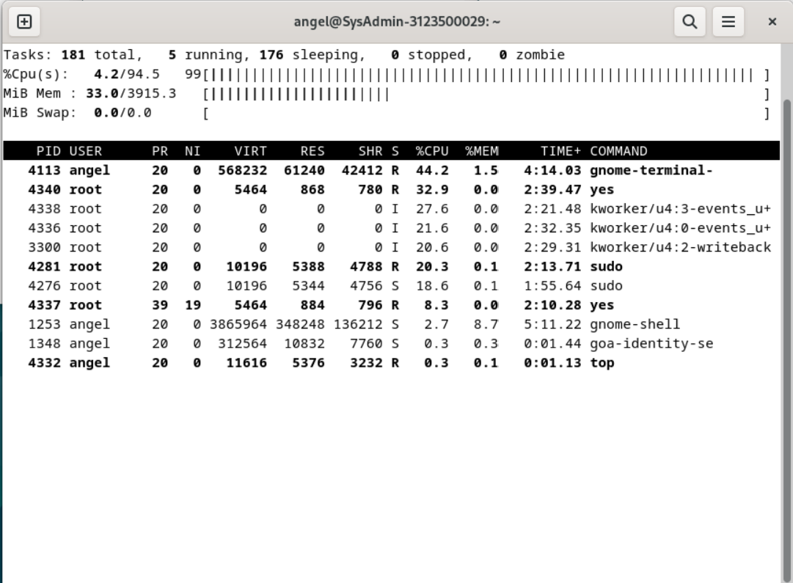

12. Program top juga mempunyai fungsi yang sama dengan program renice.Pilih Jendela Top dan tekan r. Program top terdapat prompt PID to renice: tekan 3148 (ingat bahwa Anda harus mengganti 3148 dengan PID Anda sendiri) dan tekan Enter. Program top memberikan prompt Renice `PID 3148 to value: tekan -19` dan tekan Enter.

    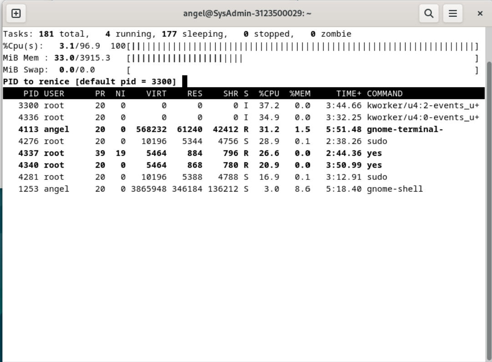

    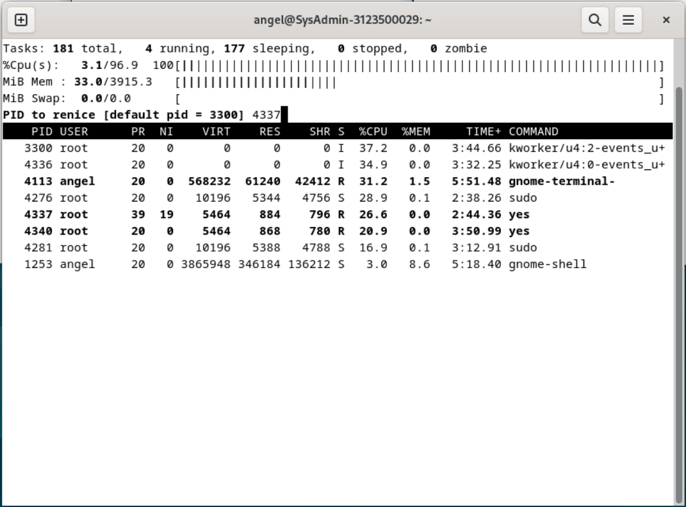

    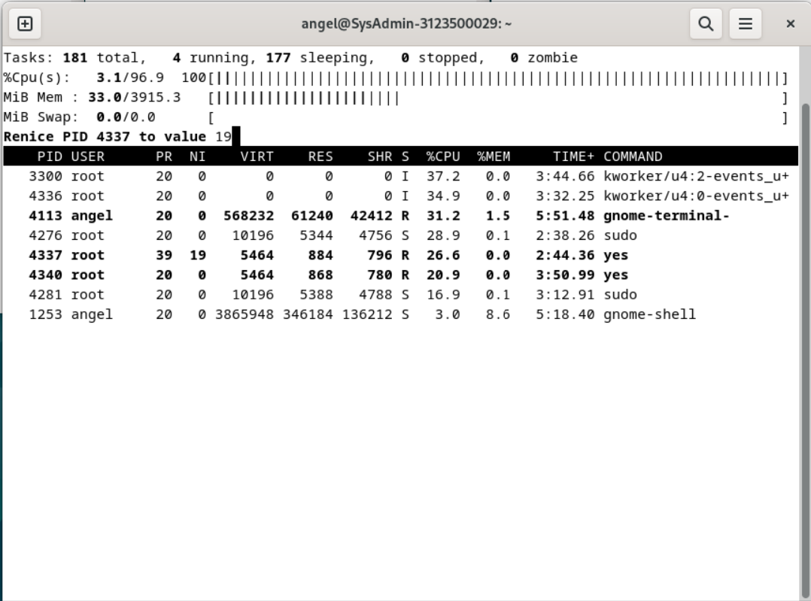

13.	Tunggu beberapa saat sampai top berubah dan lihat nilai %CPU pada kedua proses. Sekarang proses 3148 lebih cepat dari proses 3149. Kolom status menunjukkan < pada proses 3148 yang menunjukkan penjadwalan prioritas lebih rendah (lebih cepat) dari nilai 0.

    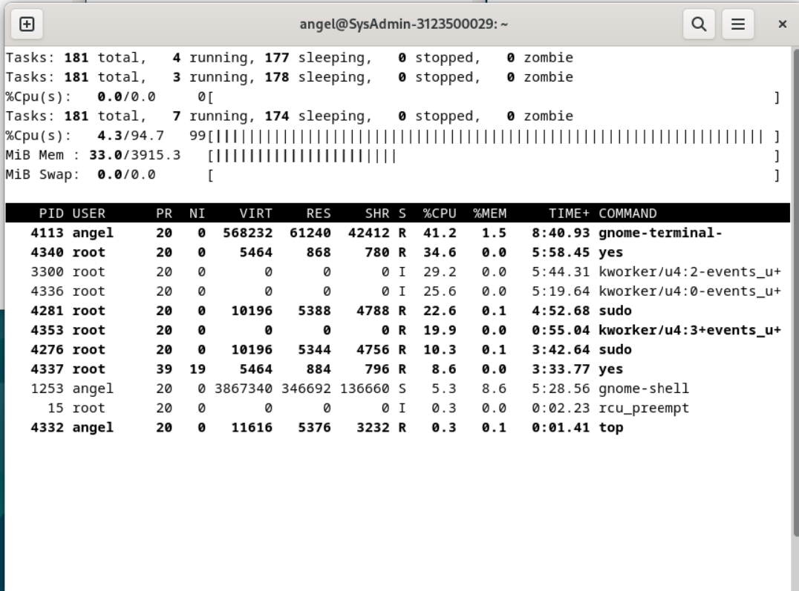

14.	Pilih terminal 3 (yang sedang tidak menjalankan yes atau program top) dan ketik nice –n -10 yes dan tekan Enter. Tunggu beberapa saat agar program top berubah dan akan terlihat proses primes ketiga. Misalnya PID nya 4107. Opsi -10 berada pada kolom NI (penjadwalan prioritas).

    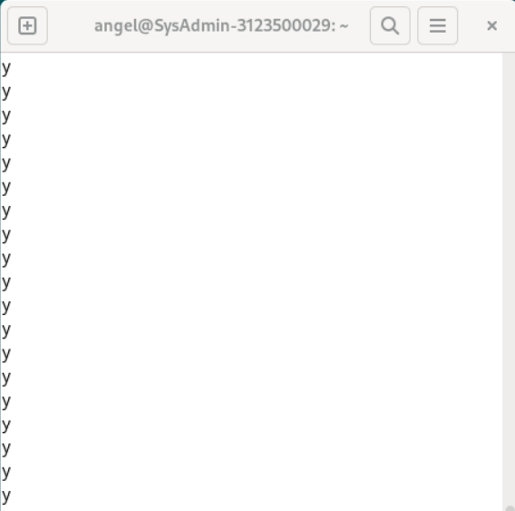

15.	Jangan menggunakan mouse dan keyboard selama 10 detik. Program top menampilkan proses yang aktif selain program yes. Maka akan terlihat proses top terdaftar tetapi %CPU kecil (dibawah 1.0) dan konsisten. Juga terlihat proses berhubungan dengan dekstop grafis seperti X, panel dll.

    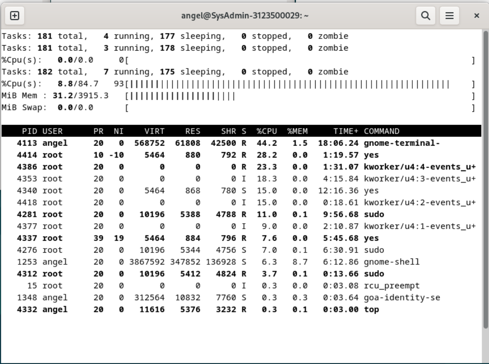

16.	Pindahkan mouse sehingga kursor berubah pada screen dan lihat apa yangterjadi dengan tampilan top. Proses tambahan akan muncul dan nilai %CPU berubah sebagai bagian grafis yang bekerja. Satu alasan adalah bahwa proses 4107 berjalan pada penjadwalan prioritas tinggi. Pilih jendela Top, ketik r. PID to renice : muncul prompt. Ketik 4107 (ubahlah 4107 dengan PID Anda) dan tekan Enter. Renice PID 4107 to value: muncul prompt. Ketik 0 dan tekan Enter. Sekarang pindahkan mouse ke sekeliling screen. Lihat perubahannya.

    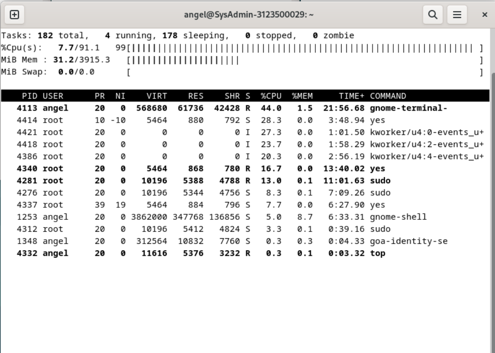

17.	Tutup semua terminal window.

18.	Logout dan login kembali sebagai user.

## Tugas Pendahuluan

1.	Masuk ke tty2 dengan Ctrl+Alt+F2. Ketik ps – au dan tekan Enter. Kemudian perhatikan keluaran sebagai berikut :

    a.	Sebutkan nama -nama proses yang bukan root

    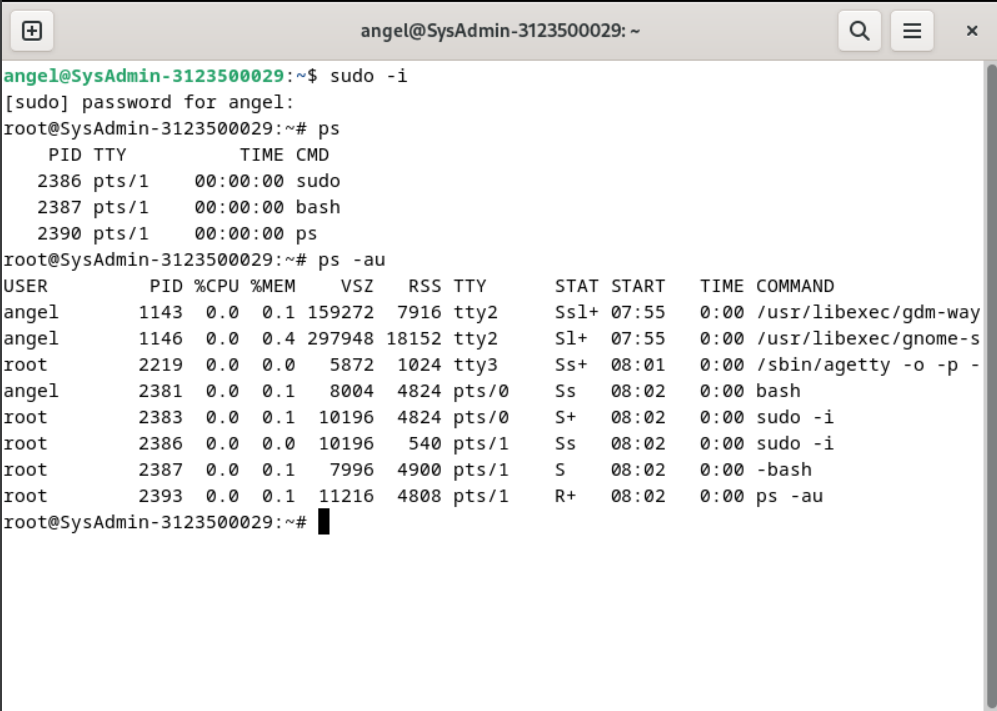

    Analisis
    - Semua proses kecuali proses yang dijalankan oleh user root yaitu
        - `/sbin/agetty -o -p -..`

        - `bash`

        - `sudo -i`

        - `pa -au`
    
        Proses diatas didapatkan setelah login sebagai root pada tty 2 dimana apabila kolom user bernama selain root maka ps tersebut tidak dijalankan oleh user selaku root

    b.	Tulis PID dan COMMAND dari proses yang paling banyak menggunakan CPU time
    
    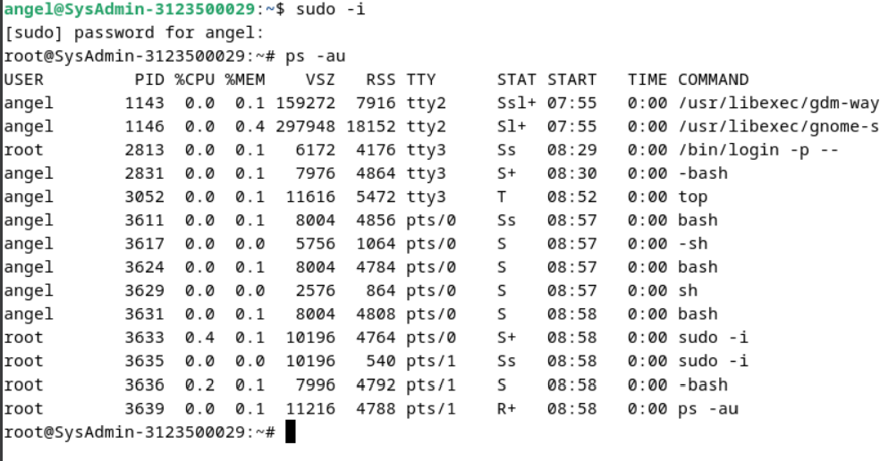
     
    - PID -> 3633 | CMD -> sudo -i Karena menggunakan CPU paling banyak sebesar 0.4.

    c. Sebutkan buyut proses dan PID dari proses tersebut 
    -  `/usr/libexec/gdm-wayland-session`

    d.	Sebutkan beberapa proses daemon
        
        Dari prosea diatas tidak ada proses daemon

    e. Pada prompt login lakukan hal- hal sebagai berikut :
    
    - `$ csh`

    - `$ who`

    - `$ bash`

    - `$ ls`

    - `$ sh`

    - `$ ps`

    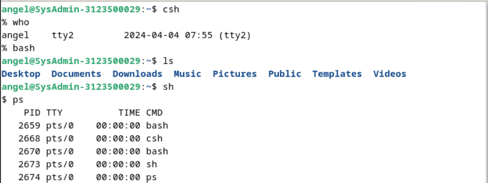
    
     Analisis:

    - `$ csh`adalah perintah untuk memulai shell C (C Shell).

    - `$ who` digunakan untuk menampilkan informasi tentang pengguna yang saat ini masuk ke sistem

    - `$ bash` adalah perintah untuk memulai shell Bash (Bourne Again Shell).

    - `$ ls` Perintah ls digunakan untuk menampilkan daftar isi dari direktori yang sedang aktif.

    - `$ sh` adalah perintah untuk memulai shell standar (Shell Bourne)

    - `$ ps` digunakan untuk menampilkan daftar proses yang sedang berjalan di sistem

    

    f.	Sebutkan PID yang paling besar dan kemudian buat urut-urutan proses sampai ke PPID = 1.

      - PID -> 2674 | CMD -> ps
      - PID -> 2673 | CMD -> sh
      - PID -> 2670 | CMD -> bash
      - PID -> 2668 | CMD -> csh
      - PID -> 2659 | CMD -> bash

    

2.	Cobalah format tampilan ps dengan opsi berikut dan perhatikan hasil tampilannya :

    •	-f	daftar penuh

    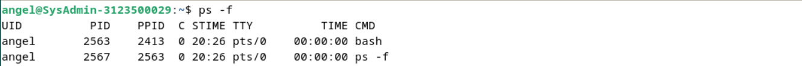

    •	-j	format job

    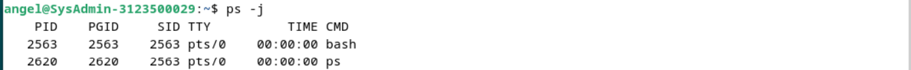

    •	j	format job control

    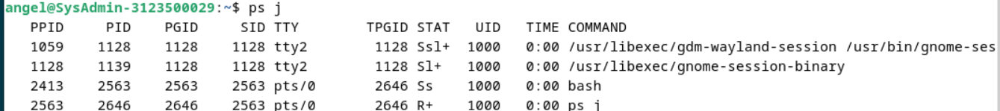

    •	l	daftar memanjang

    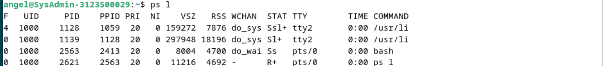

    •	s	format sinyal

    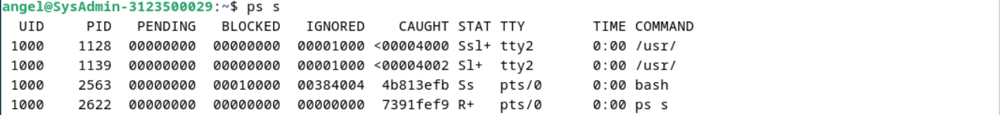

    •	v	format virtual memory

    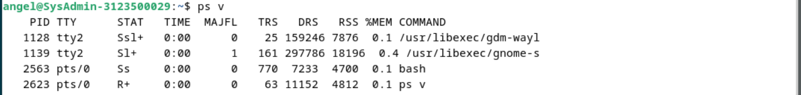

    •	X	format register i386

    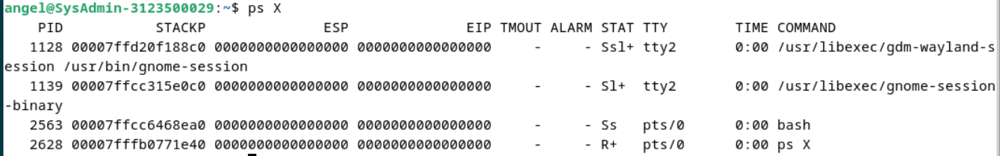

     
    Analisis:

    - `-f` menghasilkan daftar penuh dari setiap proses yaitu ID proses (PID), ID proses induk (PPID), waktu CPU, STIME, CMD.

    - `-j` mengatur format output untuk menampilkan informasi tentang pekerjaan yang terkait dengan setiap proses yaitu ID proses (PID), ID proses induk (PPID), PGID, TTY, STAT, TPGID, UID, SID, TIME, COMMAND.

    - `l` daftar memanjang yang terdiri dari  ID proses (PID), ID proses induk (PPID), F, WCHAN,  PRI, NI, VSZ, TTY, STAT, UID, SID, TIME, COMMAND.

    - `s` format sinyal yang terdiri dari  ID proses (PID), PENDING, BLOCKED, IGNORE, CAUGHT, STAY, TTY, STAT, UID, TIME, COMMAND.

    - `v` format virtual memory yang terdiri dari PID, TTY, TIME, EIP, TMOUT, ALARM, STAT, TTY, TIME, COMMAND

    - `X`	format register i386 yang menampilkan status CPU register terdiri atas PID, STACKP, ESP, EIP, TMOUT, ALARM, STAT, TTY, TIME, COMMAND
 

3.	Lakukan urutan pekerjaan berikut :
    
    a.	Gunakan perintah find ke seluruh direktory pada sistem, belokkan output sehingga daftar direktori dialihkan ke file directories.txt dan daftar pesan error dialihkan ke file errors.txt

    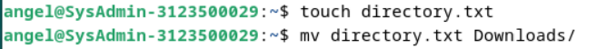
    
    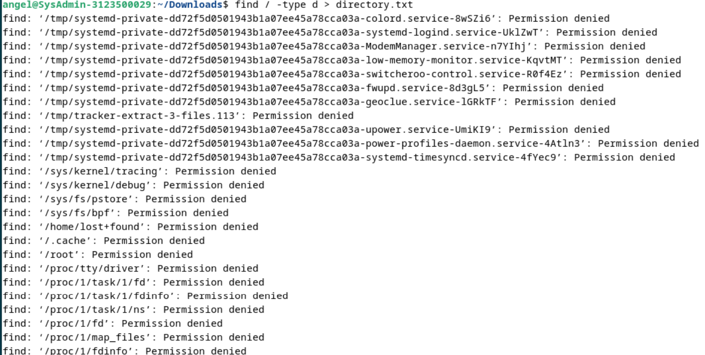

    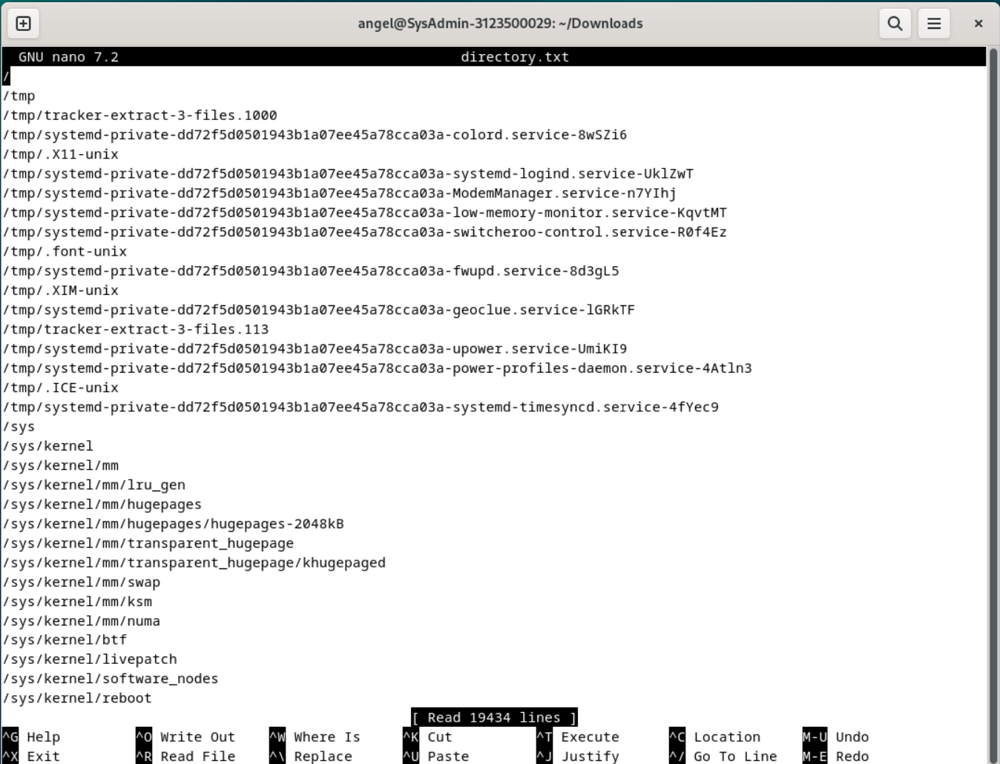

    

    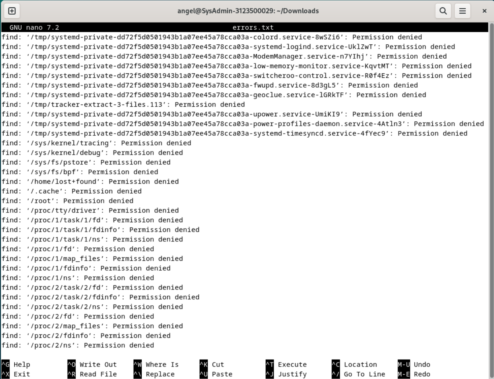

      Analisis:  
    Langkah pertama adalah membuat file directory.txt lalu letakkan pada directory Download lalu gunakan perintah `$ find / type d > directory.txt` lalu untuk melihat isinya buka dengan perintah `$ nano directory.txt`. Untuk membelokkan pesan errornya gunakan perintah `$ find / type d 2> errors.txt` kemudian buka filenya dengan perintah `$ nano errors.txt` apabila semua file suda terisi maka pembelokan sudah berhasil.
    

    b.	Gunakan perintah sleep 5. 
    Apa yang terjadi dengan perintah ini ?

    
      Analisis:  
    `$ sleep 5` memberi jeda menampilkan bash baru selama 5 detik 

    c.	Jalankan perintah pada background menggunakan & 

    

      Analisis:  
    `$ sleep 5` memberi jeda selama 5 detik pada background

    
    d.	Jalankan sleep 15 pada foreground , hentikan sementara dengan Ctrl- Z dan kemudian letakkan pada background dengan bg.   Ketikkan jobs. Ketikkan ps. Kembalikan job ke foreground dengan perintah fg.

    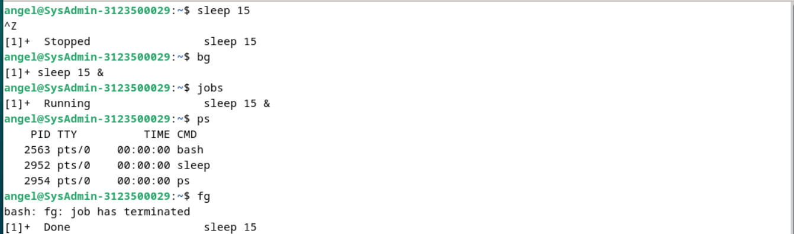

       Analisis:  
    `$ sleep 15` memberi jeda kepada terminal selama 15 detik pada frontground dan akan terhenti sementara dengan menggunakan `CTRL-Z` lalu akan dijalankan kembali di background jika melakukan perintah `$ bg` yang bisa dilihat pada `$ jobs` prosesnya atau `$ ps` untuk ketersediaan proses sleep lalu ubah ke `$ fg` dimana proses akan dikembalikan ke frontground dalam hal ini proses `$ sleep 15` sudah selesai.
    
    e.	Jalankan sleep 15 pada background menggunakan & dan kemudian gunakan perintah kill untuk menghentikan proses diikuti job number.

    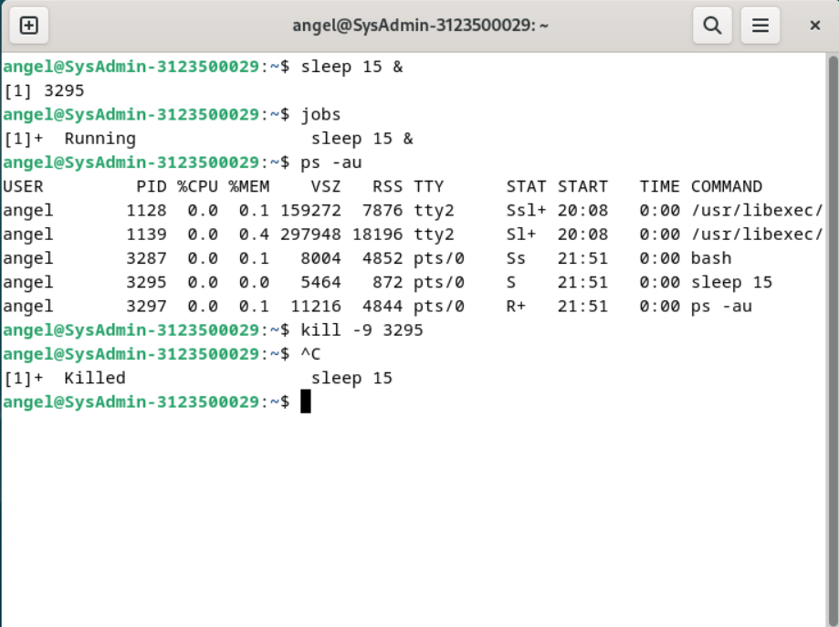

      Analisis:  
    `$ sleep 15 &` berjalan pada background dengan jobs [1] PID 3295 dengan status running. Perintah kill ditujukan untuk menghentikan proses sleep `kill -9 3295`. Status kill dapat dilihat dengan melakukan klik `CTRL-C.
    
    f.	Jalankan sleep 15 pada background menggunakan & dan kemudian gunakan kill untuk menghentikan sementara proses. Gunakan bg untuk melanjutkan menjalankan proses.

    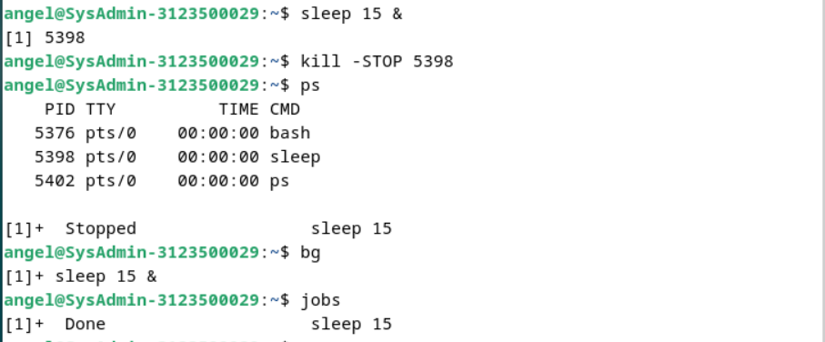
      Analisis:  
    `$ sleep 15 &` berjalan pada background dengan jobs [1] PID 5398 dengan status running. Proses tersebut dapat dihentikan sementara dengan perintah `$ kill -STOP 5398`yang dapat dilihat status pemberhentian sementaranya melalui perintah `$ ps`. Proses sleep dijalankan kembali di background `$ bg` dengan menampilkan penambahakn jobs untuk proses sleep. Kemudian menggunakan perintah `$ job` untuk melihat status proses ` $ sleep 15 &`.
    
    g.	Jalankan sleep 60 pada background 5 kali dan terminasi semua pada dengan menggunakan perintah killall.

    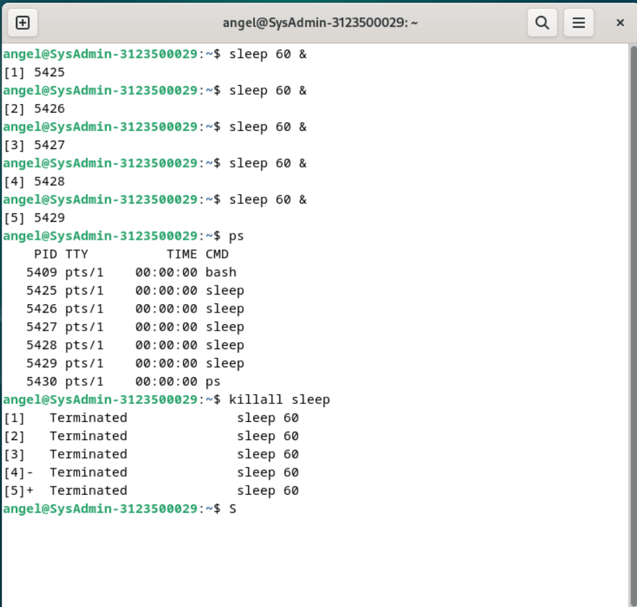
      Analisis:  
    `$ sleep 60` sebanyak 5 berjalan pada frontground dengan banyak PID. untuk melihat status proses dan nama prosesnya bisa melihat dengan perintah `$ ps` lalu gunakan perintah `$ killall sleep` untuk menghapus semua proses sleep.

    
    h.	Gunakan perintah ps, w dan top untuk menunjukkan semua proses yang sedang dieksekusi.
    
    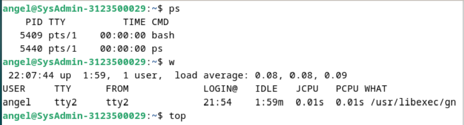

    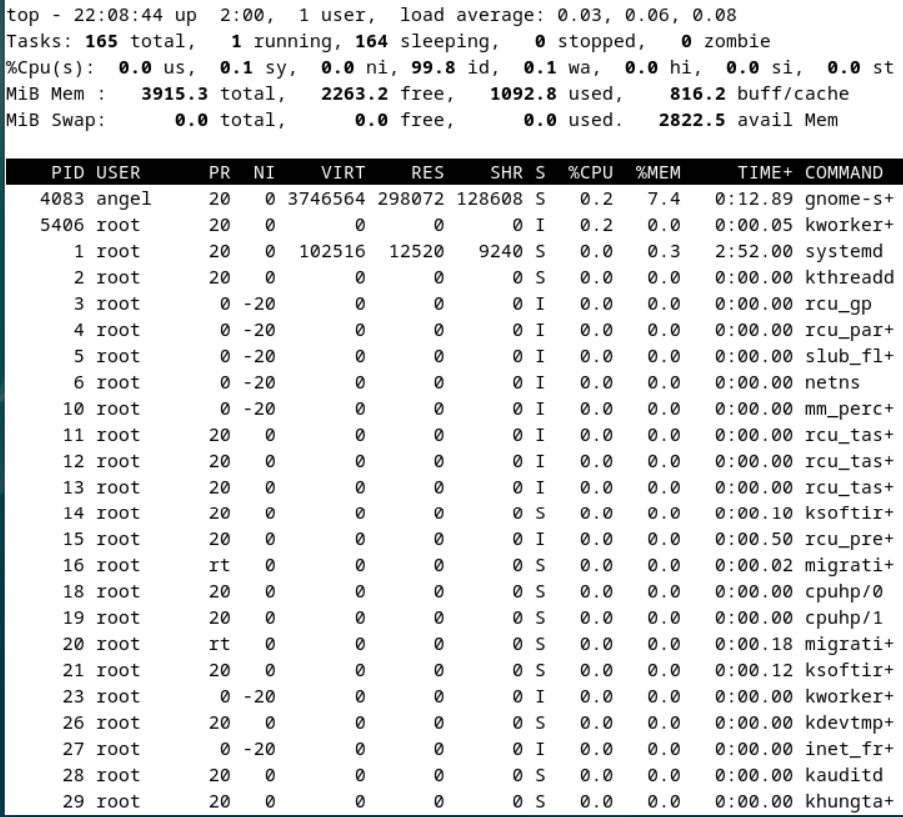

      Analisis:  
    Perintah `$ ps`, `$ w`, dan `$ top` sama-sama menunjukkan proses yang dieksekusi pada linux. Perbedaannya adalah perintah `$ ps` menunjukkan proses yang sedang aktif perintah `$ w`menunjukkan siapa saja user yang login dan apa yang user tersebut lakukan, sedagkan perintah `$ top` digunakan untuk menunjukkan semua proses yang sedang dieksekusi.

    i.	Gunakan perintah ps –aeH untuk menampilkan hierarki proses. Carilah init proses. Apakah Anda bisa identifikasi sistem daemon yang penting ? Dapatkan Anda identifikasi shell dan subprose s ?

    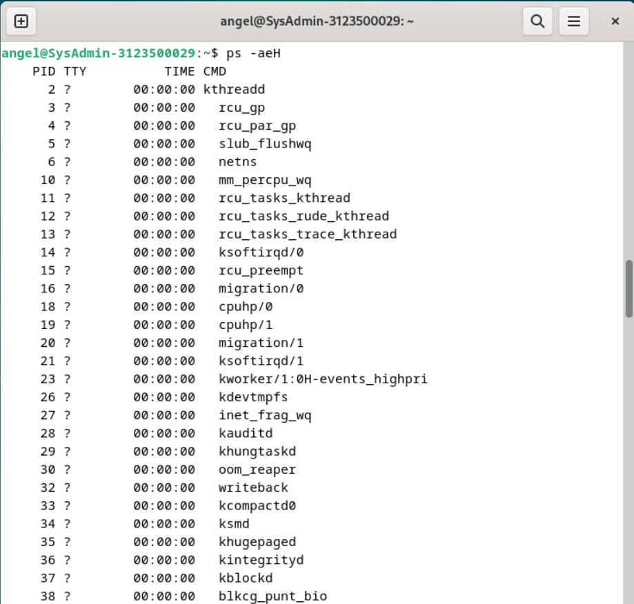
      Analisis:  

    
    j.	Kombinasikan ps –fae dan grep, apa yang Anda lihat ?

    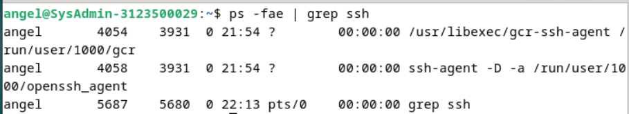
      Analisis:  
    Saya menambahkan peintah `ssh`yang dimana `$ ps fae | grep ssh` akan menampilkan daftar proses yang sedang berjalan di sistem, termasuk proses-proses yang terkait dengan SSH, dengan menggunakan format pohon untuk menunjukkan hubungan hierarki antara proses-proses tersebut

    
    k.	Jalankan proses sleep 300 pada background. Log off komputer dan log in kembali. Lihat daftar semua proses yang berjalan. Apa yang terjadi pada proses sleep ?

    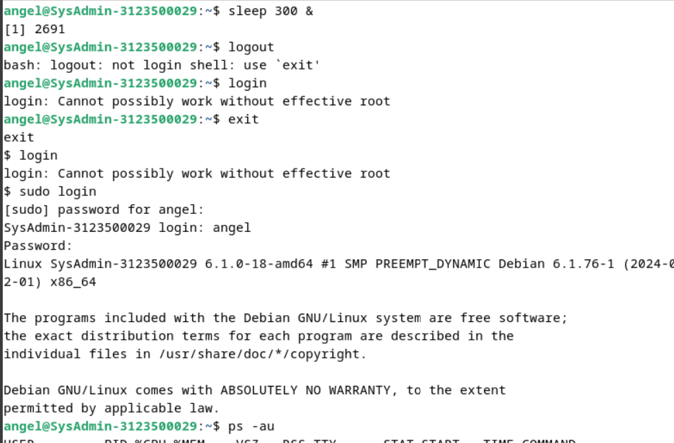

    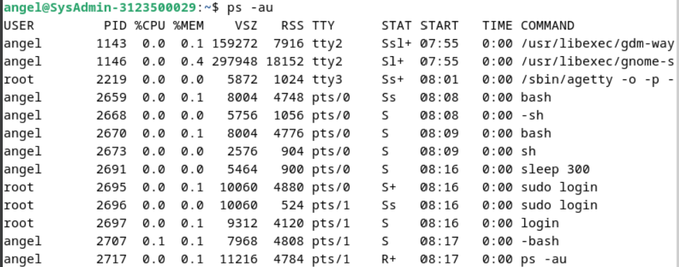
      Analisis:  
    Apabila menjalankan peintah `$ sleep 300 &` akan berjalan pada background dan meskipun user logout proses tersebut masih berjalan.

# Kesimpulan

Proses merupakan program yang sedang dieksekusi oleh CPU dimana statusnya kita bisa melihat dengan berbagai macam perintah. Dalam linuk kita bisa menggunakan banyak terminal yang penggunaannya kita bisa melihat di perintah ps atau top misalnya. Bahkan ada skala prioritas yang diatur oleh Linux dimana proses tersebut dapat dijalankan terlebih dahulu dan apabila dirasa tidak dibutuhkan bisa melakukan penghentian proses dengan perintah kill diikuti oleh PID dari proses. Proses yang berjalan pada background apabila dilakukan logout status prosesnya masih dijalankan oleh OS.

    

