

  <h1 style="font-weight: bold"> LAPORAN PRAKTIKUM VI SISTEM OPERASI Proses dan Manajemen Proses</h1>
  <h4 style="text-align: center;">Dosen Pengampu : Dr. Ferry Astika Saputra, S.T., M.Sc.</h4>

 
 

  
  <h3 style="text-align: center;">Disusun Oleh : </h3>
  

    Firsty Angelica Valency (3123500029) 
  

  <h3 style="text-align: center;line-height: 1.5">Program Studi Teknik Informatika Departemen Teknik Informatika Dan Komputer Politeknik Elektronika Negeri Surabaya 2023/2024</h3>
  

# Daftar Isi
- [Pendahuluan](#pendahuluan)
- [Tugas Pendahuluan](#Tugas_pendahuluan)
- [Daftar Pustaka](#daftar-pustaka)

# Pendahuluan
## Dasar Teori

### Process - Fork - Multithread
Setiap program atau bagian dari program yang sedang dieksekusi oleh CPU disebut dengan proses. Proses dapat berjalan secara foreground atau background.

Untuk melihat seluruh proses yang sedang berjalan gunakan perintah `$ ps -e` . Bisa juga menggunakan perintah $pstree | more untuk melihat secara detil proses yang sefan berjalan dengan format tree.

Setiap proses akan memilik PID (Process ID). Apabila dibutuhkan Sebuah proses bisa memiliki proses anakan. Dalam hubungan tersebut proses dapat diibaratkan seperti orang tua (parent) dengan anak (child) yang turun temurun.

Setiap proses memiliki parent dan child.
Setiap proses memiliki ID (pid) dan parent ID (ppid), kecuali proses init atau systemd.
ppid dari sebuah proses adalah ID dari parent proses tersebut.

Perhatikan, ppid dari proses fork01 adalah pid dari proses bash.

fork digunakan untuk menduplikasi proses. Proses yang baru disebut dengan child proses, sedangkan sistem call disebut dengan parent proses. Spesifikasi fork bisa dilihat dengan `$ man 2 fork`.

    int main() { 
                                pid: 2308, ppid: 10 
                                [Main process]
                                    |
    fork();              > Child process created <
                                    +
                                /   \
                                /       \
                pid: 2308, ppid: 10    pid: 30, ppid: 2308
                    [Parent Process]    [Child Process]

    return 0;
    }
perhatikan bahwa :

`pid Parent Process == ppid Child`

`child_id Parent Process == pid Child Process`

`Exec` adalah function yang digunakan untuk menjalankan program baru dan mengganti program yang sedang berlangsung. exec adalah program family yang memiliki berbagai fungsi variasi, yaitu `execvp`, `execlp`, `execv`, dan lain lain.

`wait` adalah function yang digunakan untuk mendapatkan informasi ketika child proses berganti state-nya. Pergantian state dapat berupa termination, resume, atau stop.

Manual: `$ man 3 exec`

# Tugas Pendahuluan

### Tugas 1
### 1. Fork : Parent - Child Process

a.  Buat tulisan tentang konsep fork dan implementasinya dengan menggunakan bahasa pemrograman C! (minimal 2 paragraf disertai dengan gambar)

 Jawab:  

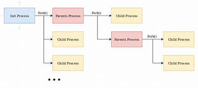

**System Call Fork ()** digunakan untuk membuat proses baru di Linux, dan sistem Unix, yang disebut proses anak, yang berjalan bersamaan dengan proses yang membuat sistem call fork() (proses parent). Setelah proses child baru dibuat, kedua proses akan menjalankan instruksi berikutnya setelah panggilan sistem fork().

Proses child menggunakan pc yang sama (program counter), register CPU yang sama, dan open file yang sama dalam proses parent. Tidak memerlukan parameter dan mengembalikan nilai integer.

- **Nilai Negatif**: Pembuatan proses child tidak berhasil.
- **Nol**: Kembali ke proses child yang baru dibuat.
- **Nilai positif**: Dikembalikan ke parent atau call. Nilai tersebut berisi ID proses dari proses child yang baru dibuat.
    
    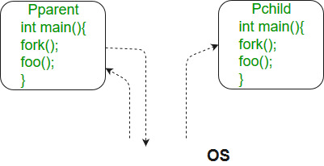

Adapun penerapannya dalam membuat fork () bahasa c pada sistem call:

- Membuat file lalu melakukan pengeditan source code pada nama file fork.c dengan prtintah `$ nano parents2.c`

    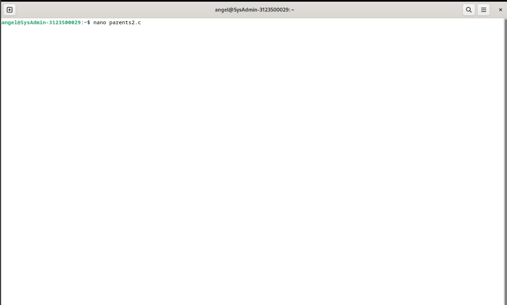

- Membuat Source Code

    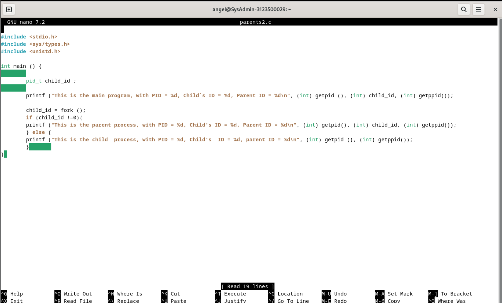

- Menampilkan isi file dengan perintah `$ gcc parents2.c -o parents2` untuk dicompile lalu menambahkan perintah `$ ./parents2` sebagai standart output

    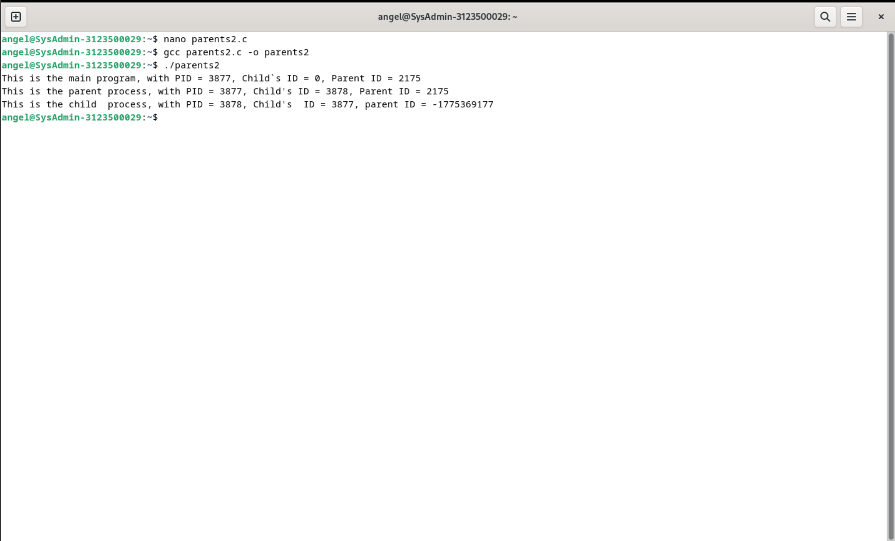

- Visualisasi

        int main() { 
                                    pid: 3877, ppid: 2175 
                                        [Main process]
                                            |
            fork();              > Child process created <
                                            +
                                         /      \
                                        /        \
                        pid: 3877, ppid: 2175    pid: 0, ppid: 3877
                            [Parent Process]       [Child Process]

        return 0;
        }
    
    Proses utama (parent) akan mencetak informasi PID dan PPID-nya, kemudian setelah fork() dipanggil, parent process dan child process akan mencetak informasi PID dan PPID masing-masing. Pada child process, nilai PID yang dikembalikan oleh getppid() akan sesuai dengan PID parent processnya. Dari visualisasi diatas dapat disimpulkan bahwa PID dari parent process sama dengan PPID child process.

b.  Akses dan clonning repo : https://github.com/ferryastika/operatingsystem.git

- Melakukan perintah git clone pada directory tertentu menggunakan perintah cd 

    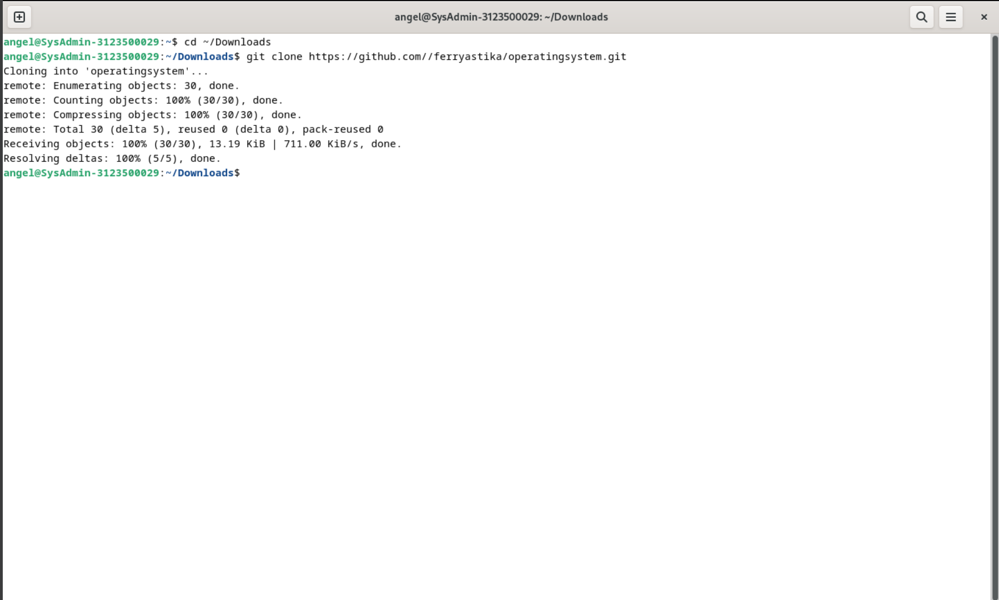

    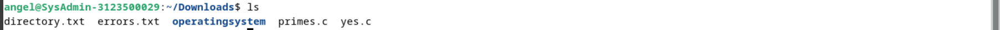

- Ubah letak direktory dari Downlaods ke Home

    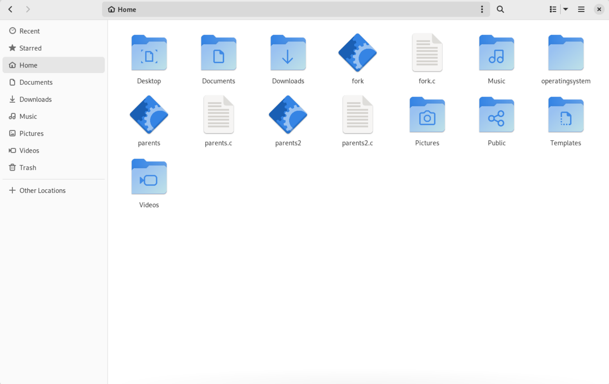

c.  Deskripsikan dan visualisasikan pohon proses hasil eksekusi dari kode program `fork01.cpp`, `fork02.cpp`, `fork03cpp`,`fork04cpp`,`fork05.cpp` dan `fork06cpp`

- Isi directory

    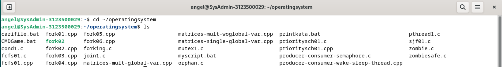

- `fork01.c`

    - Source Code

        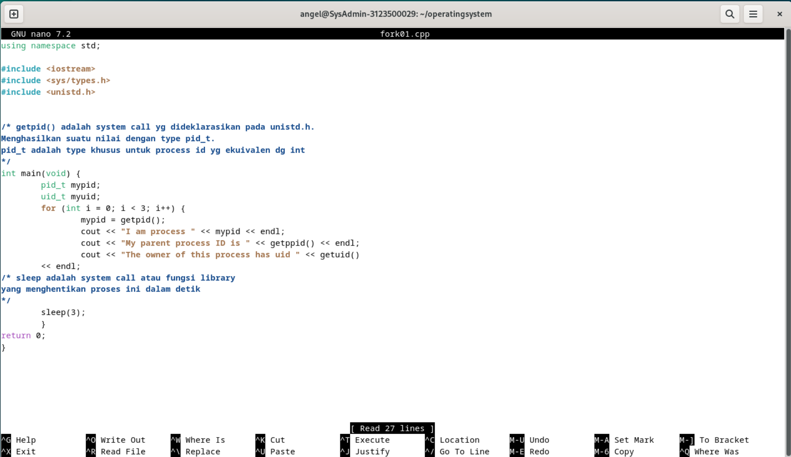

    - Output 
        
        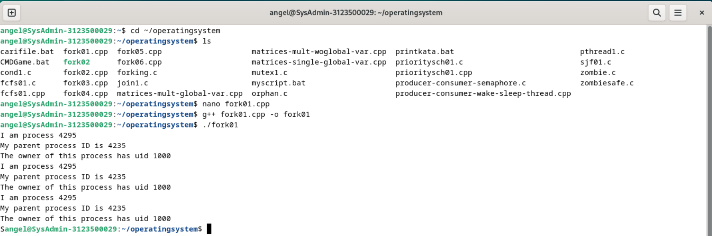
        
    - Visualisasi

            int main() { 
                                    pid: 4295, ppid: 4235 
                                       [Main process]
                                            |
                fork();             > Child process created <
                                            +
                                         /      \
                                        /        \
                        pid: 4295, ppid: 4235    pid: 0, ppid: 4295
                            [Parent Process]       [Child Process]

            return 0;
            }

   -  Deskripsi  
    Didalam visualisasi fork diatas merupakan hasil dari output dimana i am process `4295` merupakan `PID` dengan parent process ID `(PID)` `4235` dimana pada child pertama dengan `PID` `0` akan memiliki `PPID` yang sama dengan nilai PID parent process. `UID` digunakan oleh sistem operasi untuk mengelola hak akses dan hak istimewa pengguna terhadap berbagai sumber daya sistem, seperti file, direktori, proses, dan jaringan sehingga bersifat unik berupa bilangan bulat.

- `fork02.c`

    - Source Code

        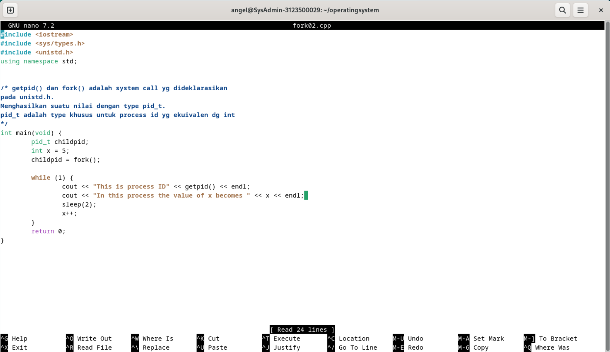
    
    - Output
        
        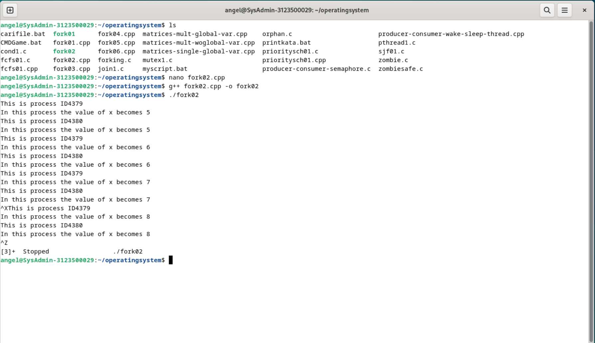
        
    - Visualisasi

            int main() { 
                                        pid: 4379
                                       [Main process]
                                            |
                fork();             > Child process created <
                                            +
                                        /       \
                                       /         \
                                 pid: 4380        ppid: 4379
                            [Parent Process]     [Child Process]
                                    /                \
                                   /                  \
                                 pid: 4379         ppid: 4380
                            [Parent Process]     [Child Process]

            return 0;
            }

   -  Deskripsi  
    Didalam visualisasi fork diatas meruapakan hasil dari output dimana menampilkan loop `PID` dengan 2 kali perulangan integer `4379` dan `4380` sebagai process ID `(PID)` dimana pada child pertama akan menghasilkan `PPID` = `PID parent process`. Loop dapat diberhentikan dengan `CTRL-Z`

- `fork03.c`

    - Source Code

        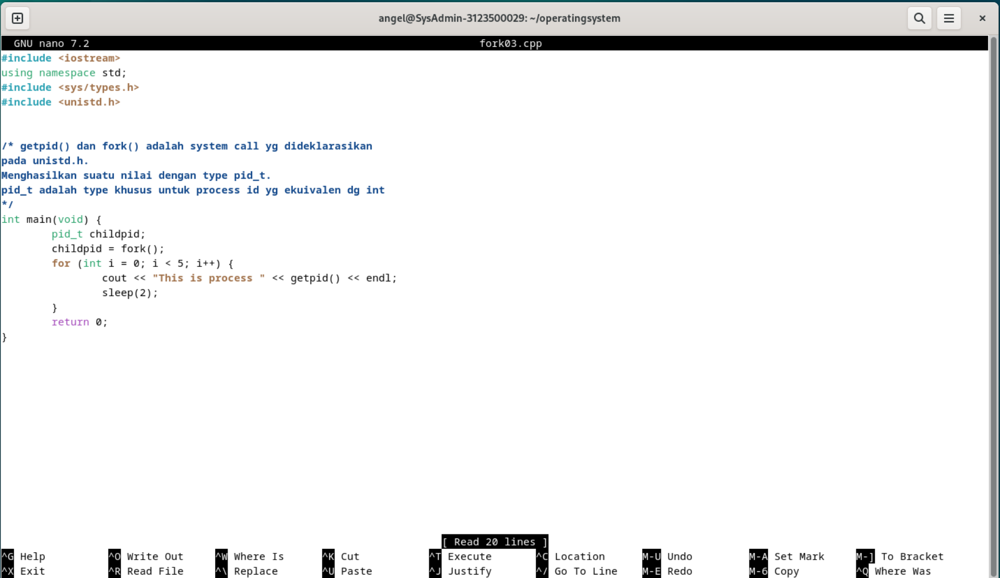
    
    - Output
        
        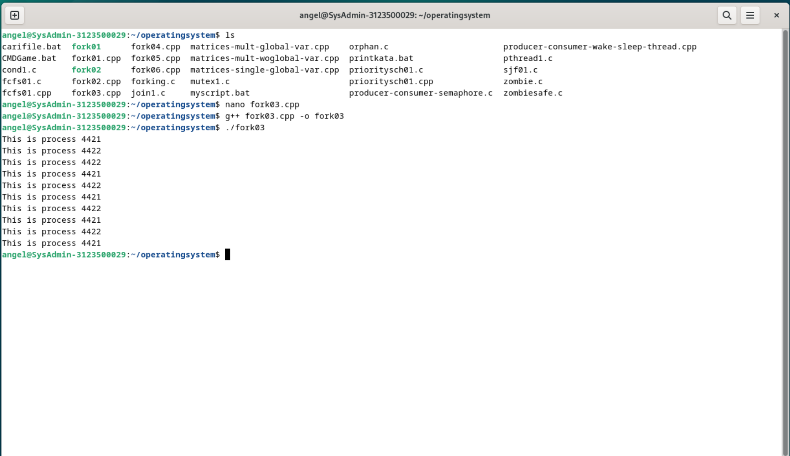
        
    - Visualisasi

            int main() { 
                                                                                pid: 4121
                                                                            [Main process]
                                                                                    |
            fork();                                                     > Child process created <
                                                                                    +
                                                                                 /        \
                                                                                /          \
                                                                        pid: 4422        ppid: 4121
                                                                    [Parent Process]     [Child Process]
                                                                     /       \
                                                                    /         \
                                                            pid: 4422        ppid: 4422
                                                        [Parent Process]    [Child Process]
                                                             /       \
                                                            /         \
                                                    pid: 4421         ppid: 4422
                                                [Parent Process]   [Child Process]
                                                        /      \
                                                       /        \
                                                pid: 4422      ppid: 4421
                                            [Parent Process]   [Child Process]
                                                 /      \
                                                /        \
                                        pid: 4421      ppid: 4422
                                    [Parent Process]   [Child Process]
                                         /      \
                                        /        \
                                pid: 4422      ppid: 4421
                            [Parent Process]   [Child Process]
                                /      \
                               /        \
                        pid: 4421      ppid: 4422
                    [Parent Process]   [Child Process]
                    

            return 0;
            }

   -  Deskripsi  
    Didalam visualisasi fork diatas meruapakan hasil dari output dimana menampilkan loop `PID` sebanyak 10 kali perulangan integer `4421` dan `4422` sebagai process ID `(PID)` dari parents process dimana pada child pertama akan menghasilkan `PPID` = `PID parent process`. 

- `fork04.c`

    - Source Code

        

        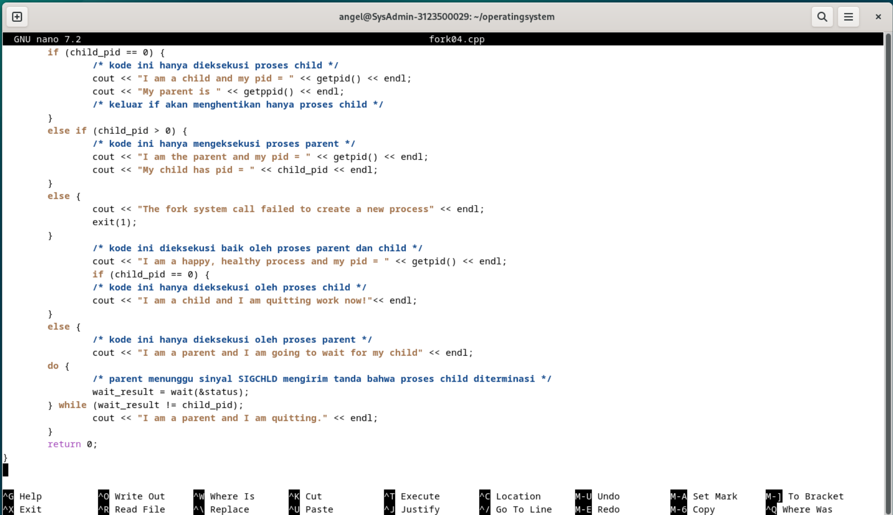

    - Output 
        
        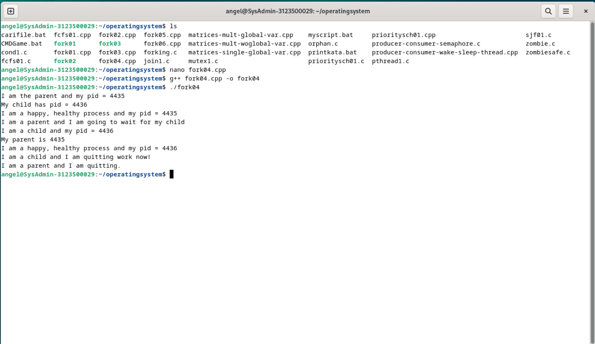
        
    - Visualisasi

            int main() { 
                                        pid: 4435 
                                       [Main process]
                                            |
                fork();             > Child process created <
                                            +
                                         /      \
                                        /        \
                        pid: 4435, ppid: 4436    pid: 4436, ppid: 4435
                            [Parent Process]       [Child Process]

            return 0;
            }

   -  Deskripsi  
    Didalam visualisasi fork diatas merupakan hasil dari output dimana i am the parent `4435` merupakan `PID` dengan parent process ID `(PID)` `4235` dimana pada child pertama dengan `PID` `4436` akan memiliki `PPID` yang sama dengan nilai PID parent process. 

- `fork05.c`

    - Source Code

        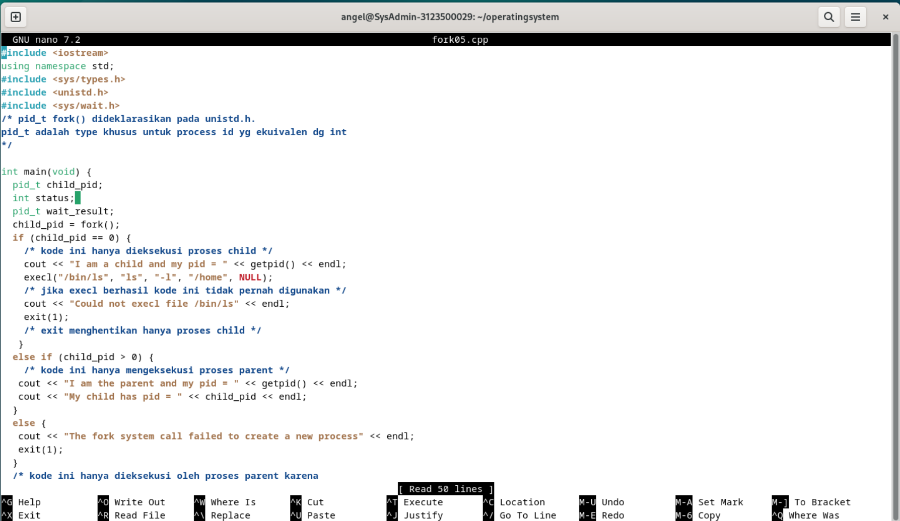

        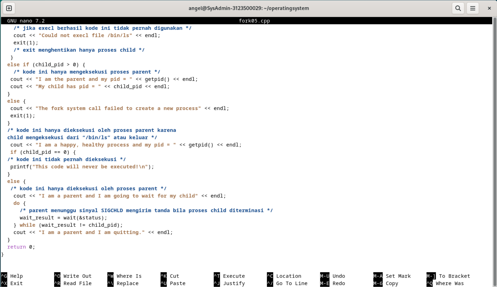
    
    - Output
        
        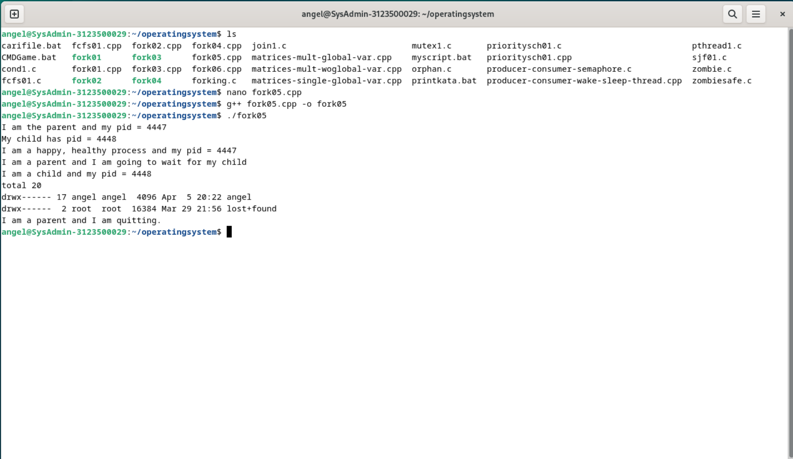
        
    - Visualisasi

            int main() { 
                                        pid: 4447
                                       [Main process]
                                            |
                fork();             > Child process created <
                                            +
                                        /       \
                                       /         \
                                 pid: 4447        pid: 4448
                            [Parent Process]     [Child Process]

            return 0;
            }

   -  Deskripsi  
    Didalam visualisasi fork diatas meruapakan hasil dari output dimana menampilkan  `PID` dengan perulangan integer `4447` dan `PPID` `4447` sebagai process ID `(PID)` dimana pada child pertama akan menghasilkan `PPID` = `PID parent process`. Program menampilkan data child status dari root dan user.

- `fork06.c`

    - Source Code

        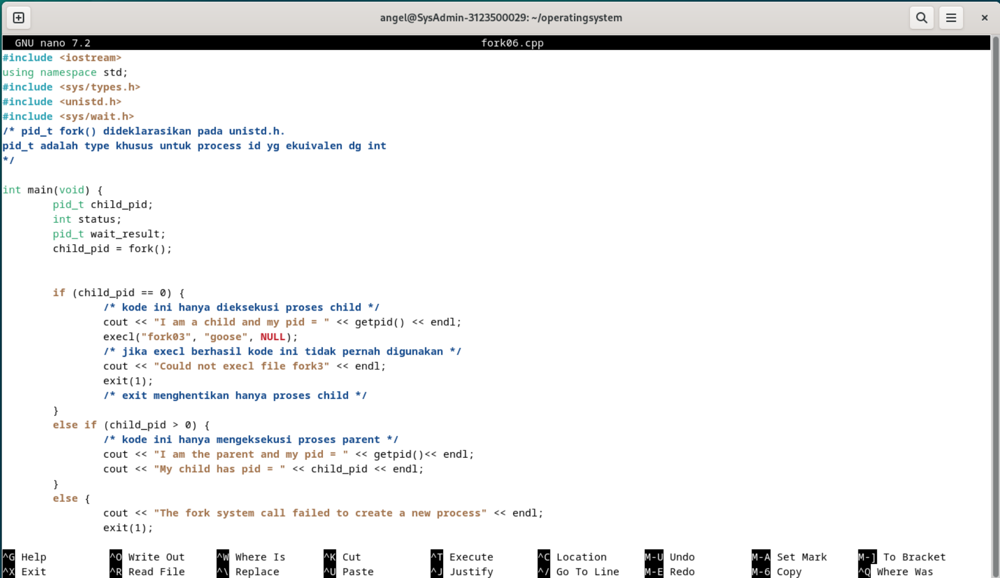

        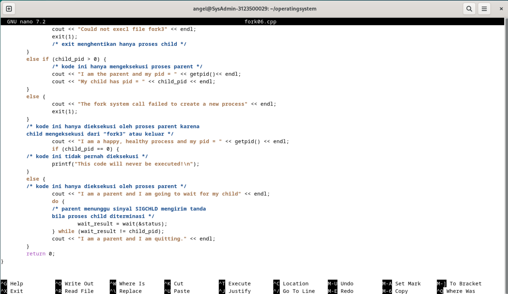
    
    - Output
        
        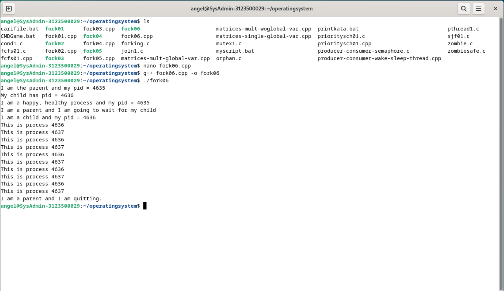
        
    - Visualisasi

            int main() { 
                                        pid: 4635
                                       [Main process]
                                            |
                fork();             > Child process created <
                                            +
                                        /       \
                                       /         \
                                 pid: 4635        pid: 4636
                            [Parent Process]     [Child Process]
                                                    /       \
                                                   /         \
                                            pid: 4636        pid: 4637
                                    [child Process]     [Child Process]
                                        /       \
                                       /         \
                               pid: 4637        pid: 4636
                           [child Process]     [Child Process]
                              /       \
                             /         \
                    pid: 4637        pid: 4636
              [child Process]     [Child Process]
        
            
            return 0;
            }

   -  Deskripsi  
    Didalam visualisasi fork diatas merupakan hasil dari output dimana menampilkan loop `PID` sebanyak 10 kali perulangan integer `4636` sebagai process ID `(PID)` dimana pada child pertama akan menghasilkan `PPID` = `PID parent process` lalu akan bercabang menghasilkan anak anak baru. 

    ### Tugas 2
    Buatlah program perkalian 2 matriks [4 x 4] dalam bahasa C yang memanfaatkan fork().

    - Make file matriks.c

        

    - Source Code

         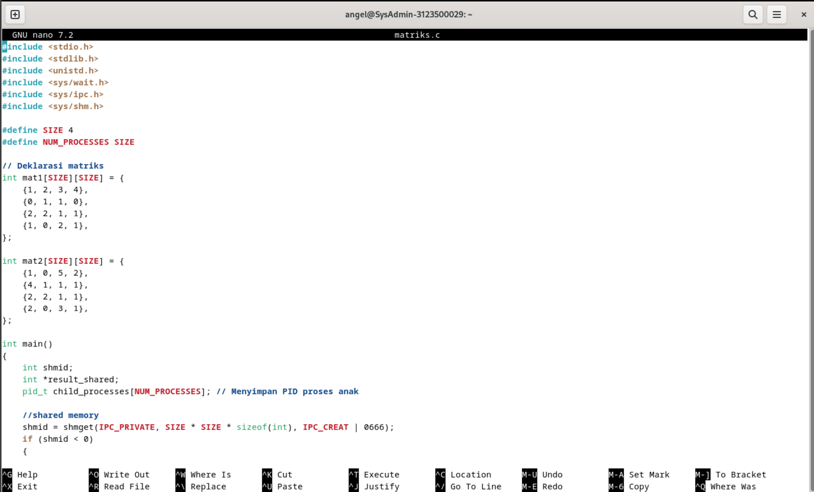
      
         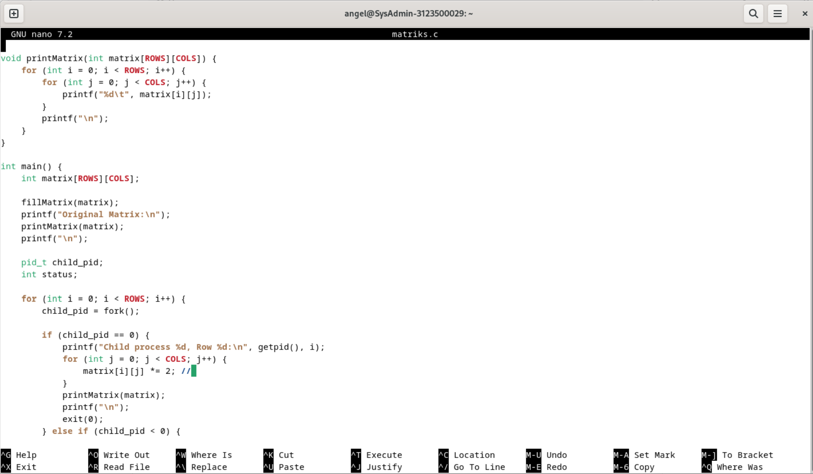
      
         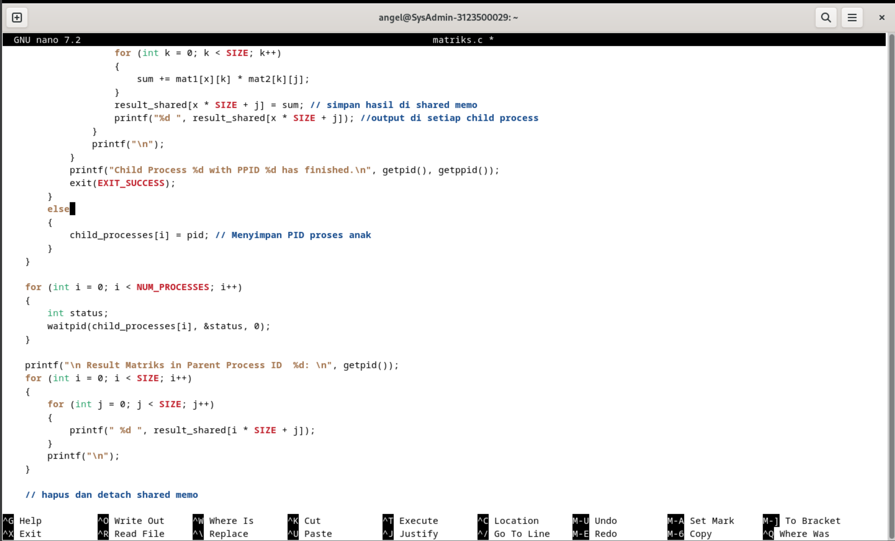

         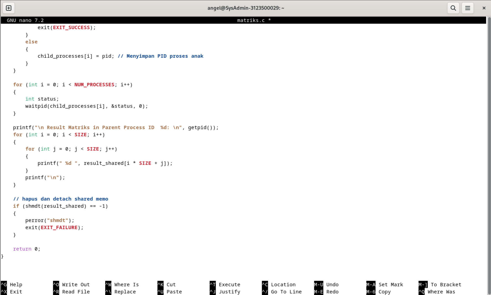
                 
    - output

        

    - Analisis
          Program diatas membagi proses perkalian baris dan kolom menjadi 4 proses child, dimana data hasilnya akan disimpan didalam memori yang nantinya akan dipanggil pada proses parents. 

# Daftar Pustaka

- https://www.geeksforgeeks.org/fork-system-call/

- https://thuecloudvps.net/tien-trinh-trong-linux/
